## Fieldwork summary

  * Enumeration was completed in 79 out of 98 initial sampled blocks.
  * 54 of the 79 initial sampled blocks enumerated resulted in expansion to adjacent blocks
  * 468 blocks (including both initial sampled and expansion blocks) were enumerated. 
  * In total, 6313 business were found during enumeration
  * Of all businesses, 4\,944 \(78%\) were eligible for the study
  * Of eligible businesses, 4\,736 \(96%\) were selected at random for interview
  * Of selected businesses, 811 \(17%\) were successfully interviewed 
  * Successful interviews originate from 59 initial sampled blocks

::: {.cell .caption-margin}
::: {.cell-output-display}
{#fig-fieldwork_map width=1152}
:::
:::

## The business landscape 

::: {.cell .caption-margin}
::: {.cell-output-display}
{#fig-nbus_size_and_sector width=1152}
:::
:::

---

::: {.cell .caption-margin}
::: {.cell-output-display}
{#fig-mse_chars width=1152}
:::
:::

---

::: {.cell .caption-margin}
::: {.cell-output-display}
{#fig-mse_sector width=1152}
:::
:::

---

::: {.cell .caption-margin}
::: {.cell-output-display}
{#fig-mses_productivity width=1152}
:::
:::

---

::: {.cell .caption-margin}
::: {.cell-output-display}
{#fig-mse_perf_subj width=1152}
:::
:::

## The small firm owner

::: {.cell .caption-margin}
::: {.cell-output-display}
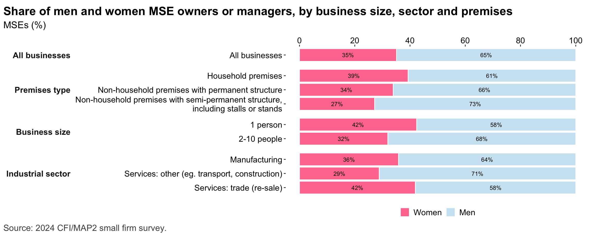{#fig-mses_chars_bygender width=1152}
:::
:::

---

::: {.cell .caption-margin}
::: {.cell-output-display}
{#fig-mse_owner_chars width=1152}
:::
:::

---

::: {.cell .caption-margin}
::: {.cell-output-display}
{#fig-mse_owner_psych width=1152}
:::
:::

---

::: {.cell .caption-margin}
::: {.cell-output-display}
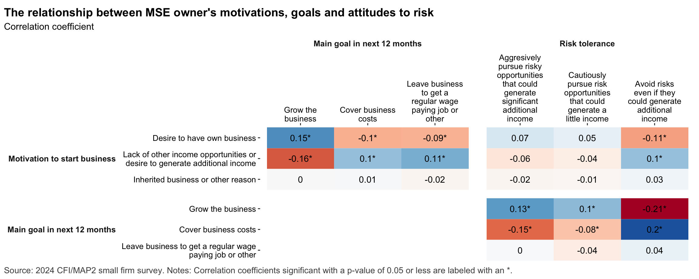{#fig-resp_psyc_corr width=1152}
:::
:::

---

::: {.cell .caption-margin}
::: {.cell-output-display}
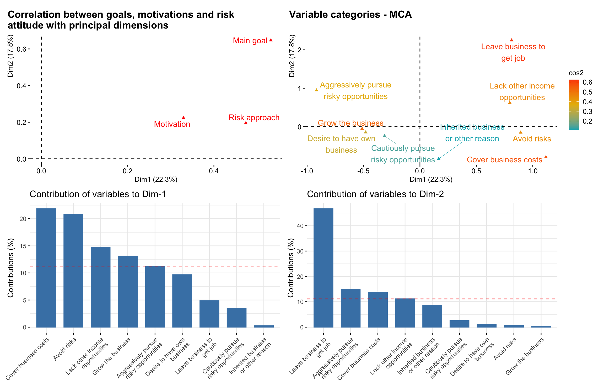{#fig-resp_psyc_mca width=1152}
:::
:::

---

::: {.cell .caption-margin}
::: {.cell-output-display}
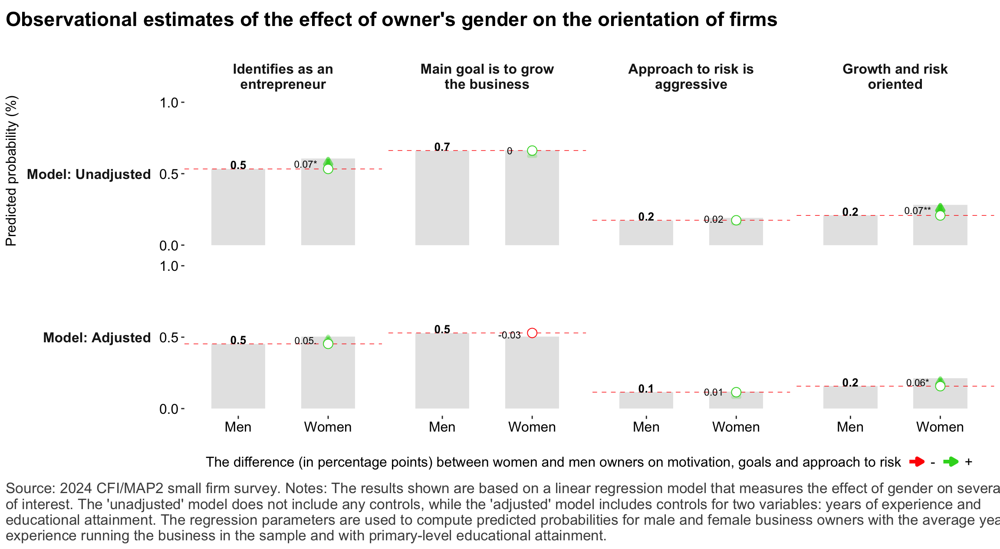{#fig-reg_growth_gender width=1152}
:::
:::

---

::: {.cell .caption-margin}
::: {.cell-output-display}
{#fig-mse_hh_owner width=1152}
:::
:::

## Digital technology 

::: {.cell .caption-margin}
::: {.cell-output-display}
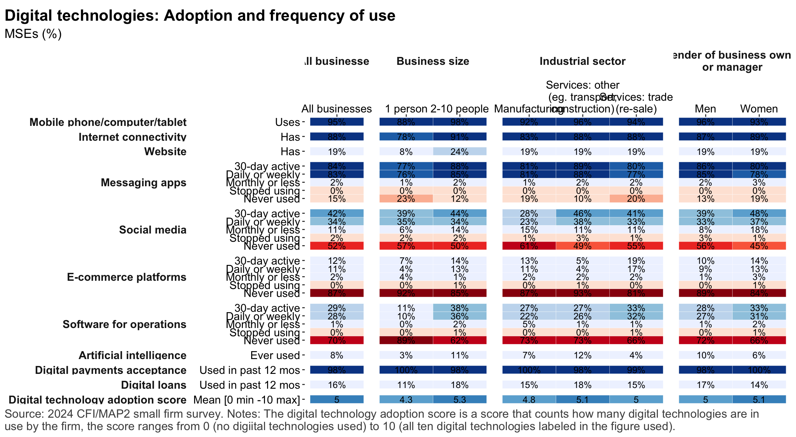{#fig-digtech_overview width=1152}
:::
:::

---

::: {.cell .caption-margin}
::: {.cell-output-display}
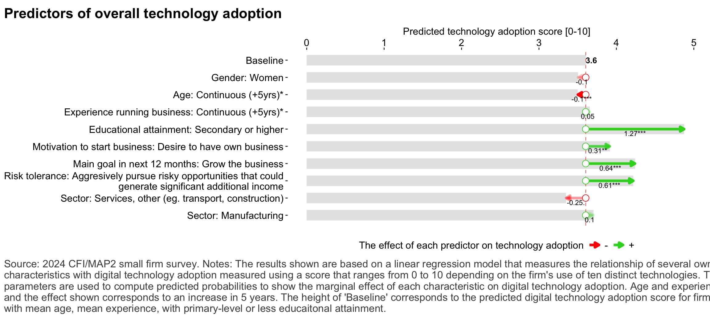{#fig-reg_digtech_drivers width=1152}
:::
:::

---

::: {.cell .caption-margin}
::: {.cell-output-display}
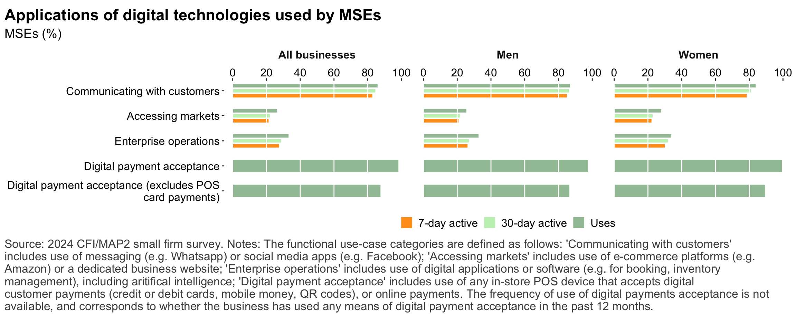{#fig-digtech_usecases width=1152}
:::
:::

---

::: {.cell .caption-margin}
::: {.cell-output-display}
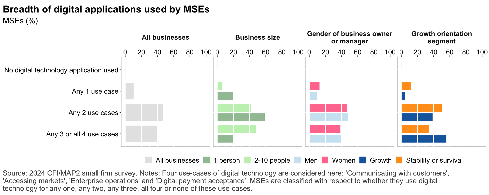{#fig-digtech_use_depth width=1152}
:::
:::

---

::: {.cell .caption-margin}
::: {.cell-output-display}
{#fig-tech_adoptionfactors width=1152}
:::
:::

--- 

::: {.cell .caption-margin}
::: {.cell-output-display}
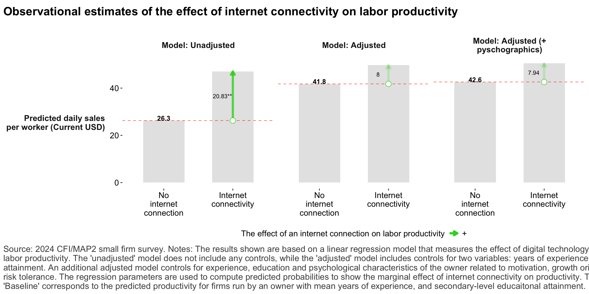{#fig-reg_revprhr_internet width=1152}
:::
:::

--- 

::: {.cell .caption-margin}
::: {.cell-output-display}
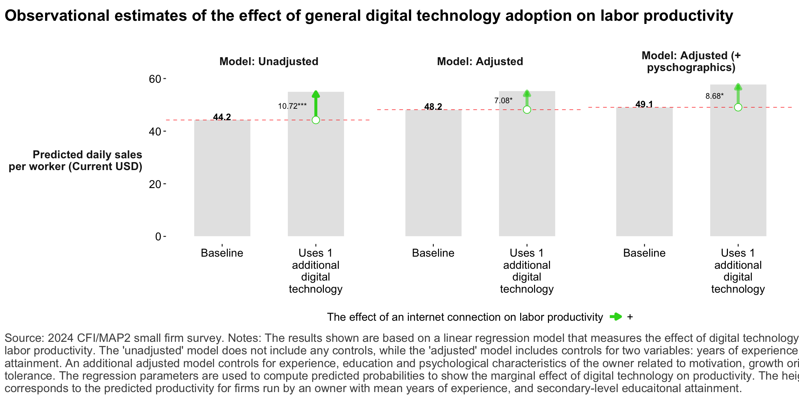{#fig-reg_revprhr_digitaladoption width=1152}
:::
:::

---

::: {.cell .caption-margin}
::: {.cell-output-display}
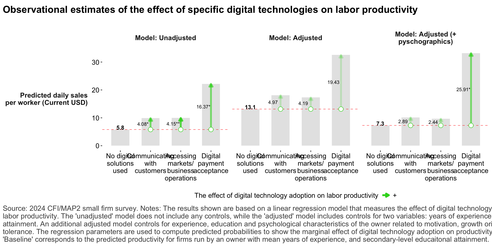{#fig-reg_revprhr_digtechusecase width=1152}
:::
:::

---

::: {.cell .caption-margin}
::: {.cell-output-display}
{#fig-reg_revprhr_digtechdepth width=1152}
:::
:::

## Financial services 

::: {.cell .caption-margin}
::: {.cell-output-display}
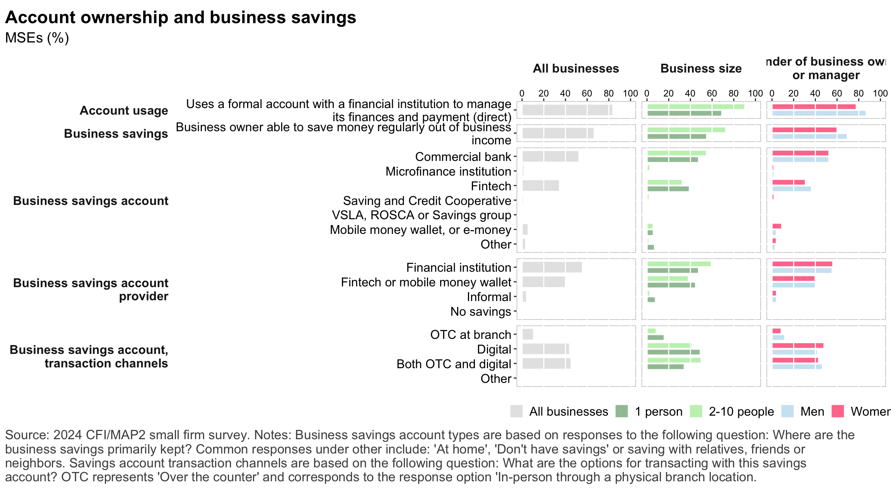{#fig-account_ownership width=1152}
:::
:::

---

::: {.cell .caption-margin}
::: {.cell-output-display}
{#fig-payments width=1152}
:::
:::

---

::: {.cell .caption-margin}
::: {.cell-output-display}
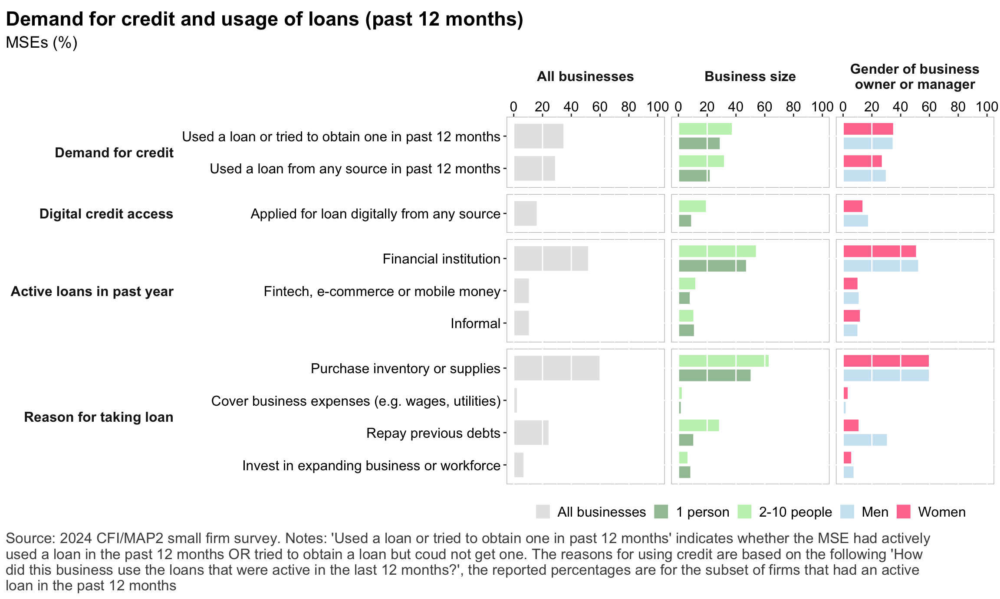{#fig-credit_demand width=1152}
:::
:::

---

::: {.cell .caption-margin}
::: {.cell-output-display}
{#fig-credit_denied width=1152}
:::
:::

---

::: {.cell .caption-margin}
::: {.cell-output-display}
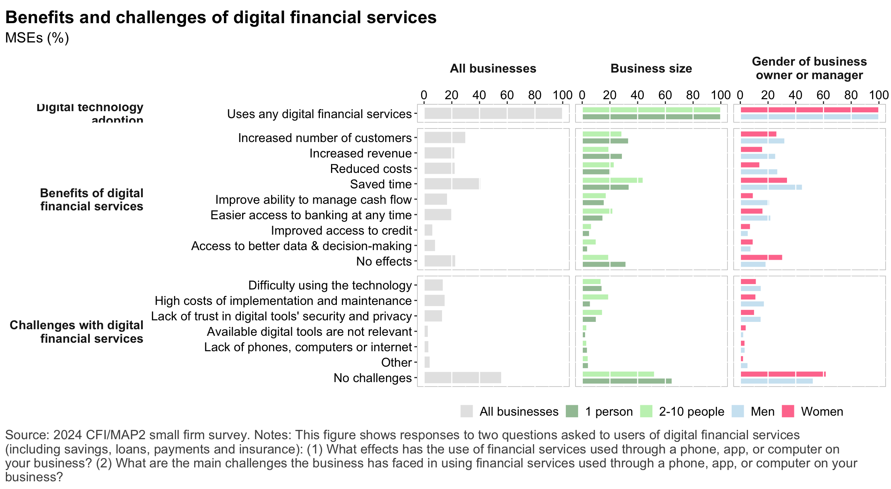{#fig-dfs_impacts width=1152}
:::
:::

## Consumer protection

::: {.cell .caption-margin}
::: {.cell-output-display}
{#fig-cp_loanrepayment width=1152}
:::
:::

---

::: {.cell .caption-margin}
::: {.cell-output-display}
{#fig-cp_issues width=1152}
:::
:::

## Risks and Resilience

::: {.cell .caption-margin}
::: {.cell-output-display}
{#fig-risks_types width=1152}
:::
:::

---

::: {.cell .caption-margin}
::: {.cell-output-display}
{#fig-risks_climate_types width=1152}
:::
:::

---

::: {.cell .caption-margin}
::: {.cell-output-display}
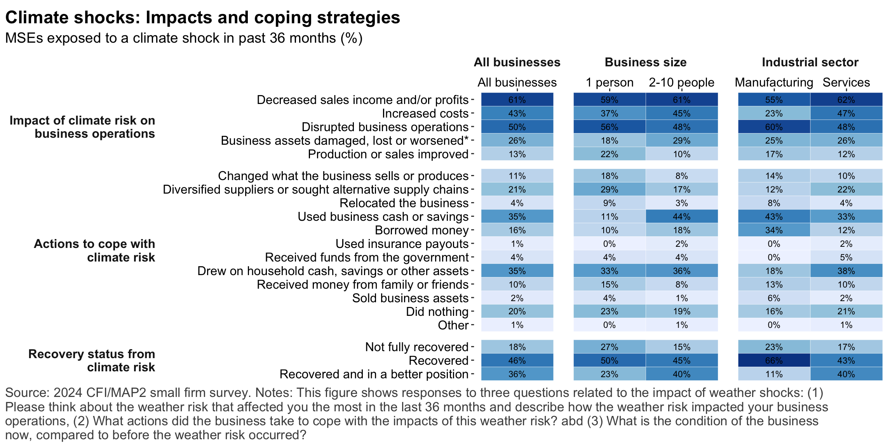{#fig-risks_impacts width=1152}
:::
:::

---

::: {.cell .caption-margin}
::: {.cell-output-display}
{#fig-resilience_financial width=1152}
:::
:::

---

::: {.cell .caption-margin}
::: {.cell-output-display}
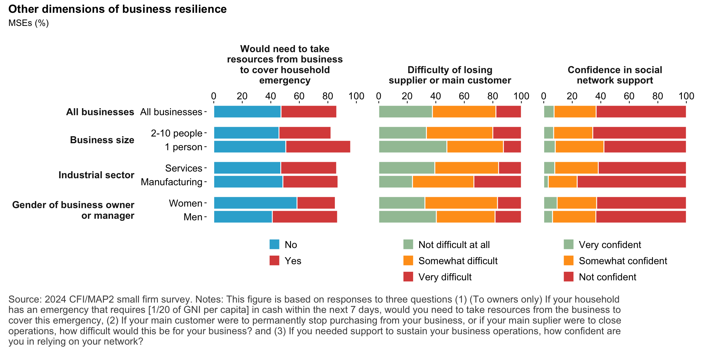{#fig-resilience_nonfinancial width=1152}
:::
:::

---

::: {.cell .caption-margin}
::: {.cell-output-display}
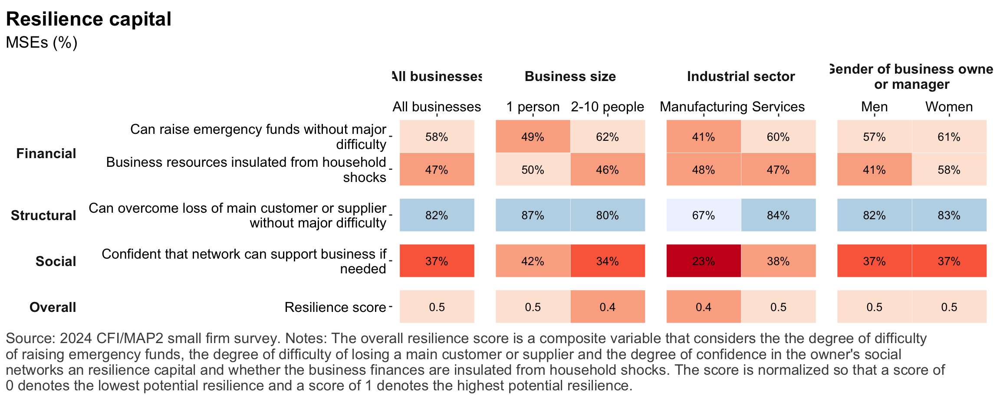{#fig-resilience_overview width=1152}
:::
:::

