## Fieldwork summary

  * Enumeration was completed in 72 out of 96 initial sampled blocks.
  * 18 of the 72 initial sampled blocks enumerated resulted in expansion to adjacent blocks
  * 184 blocks (including both initial sampled and expansion blocks) were enumerated. 
  * In total, 4460 business were found during enumeration
  * Of all businesses, 2\,887 \(65%\) were eligible for the study
  * Of eligible businesses, 905 \(31%\) were selected at random for interview
  * Of selected businesses, 812 \(90%\) were successfully interviewed 
  * Successful interviews originate from 20 initial sampled blocks

## The business landscape 

::: {.cell}
::: {.cell-output-display}
{#fig-nbus_size_and_sector width=1152}
:::
:::

::: {.cell}
::: {.cell-output-display}
{#fig-mse_chars width=1152}
:::
:::

::: {.cell}
::: {.cell-output-display}
{#fig-mses_size_and_sector width=1152}
:::
:::

## The small firm owner

::: {.cell}
::: {.cell-output-display}
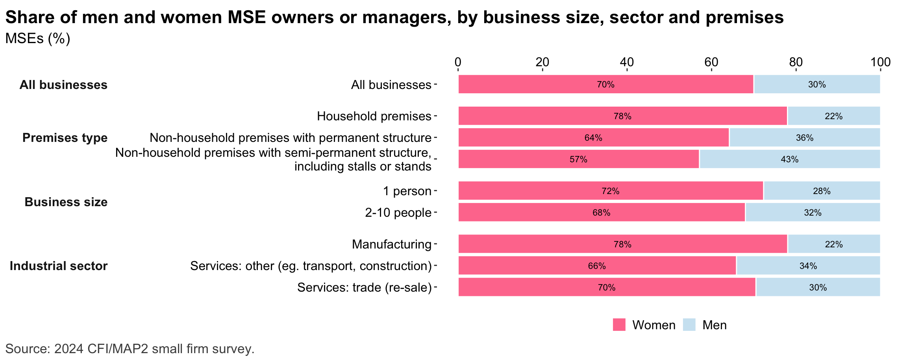{#fig-mses_chars_bygender width=1152}
:::
:::

::: {.cell}
::: {.cell-output-display}
{#fig-mse_owner_chars width=1152}
:::
:::

::: {.cell}
::: {.cell-output-display}
{#fig-mse_owner_psych width=1152}
:::
:::

::: {.cell}
::: {.cell-output-display}
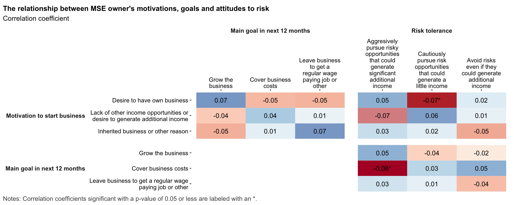{#fig-resp_psyc_corr width=1152}
:::
:::

::: {.cell}
::: {.cell-output-display}
{#fig-resp_psyc_mca width=1152}
:::
:::

::: {.cell}
::: {.cell-output-display}
{#fig-reg_growth_gender width=1152}
:::
:::

::: {.cell}
::: {.cell-output-display}
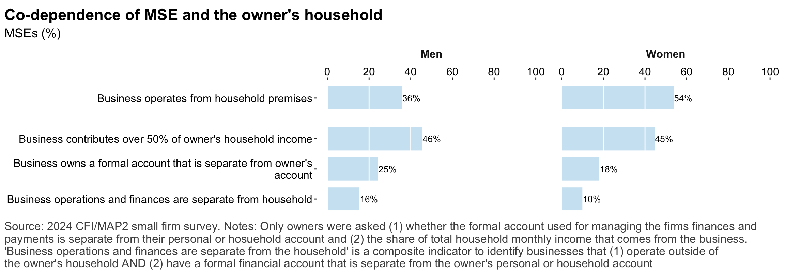{#fig-mse_hh_owner width=1152}
:::
:::

## Digital technology 

::: {.cell}
::: {.cell-output-display}
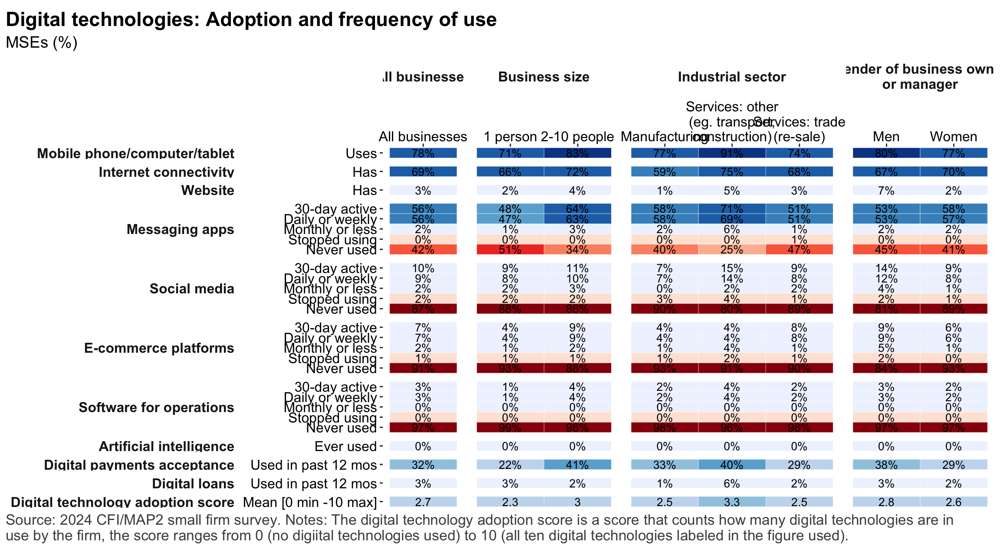{#fig-digtech_overview width=1152}
:::
:::

::: {.cell}
::: {.cell-output-display}
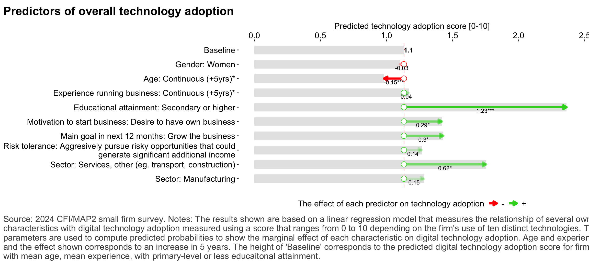{#fig-reg_digtech_drivers width=1152}
:::
:::

::: {.cell}
::: {.cell-output-display}
{#fig-digtech_usecases width=1152}
:::
:::

::: {.cell}
::: {.cell-output-display}
{#fig-digtech_use_depth width=1152}
:::
:::

::: {.cell}
::: {.cell-output-display}
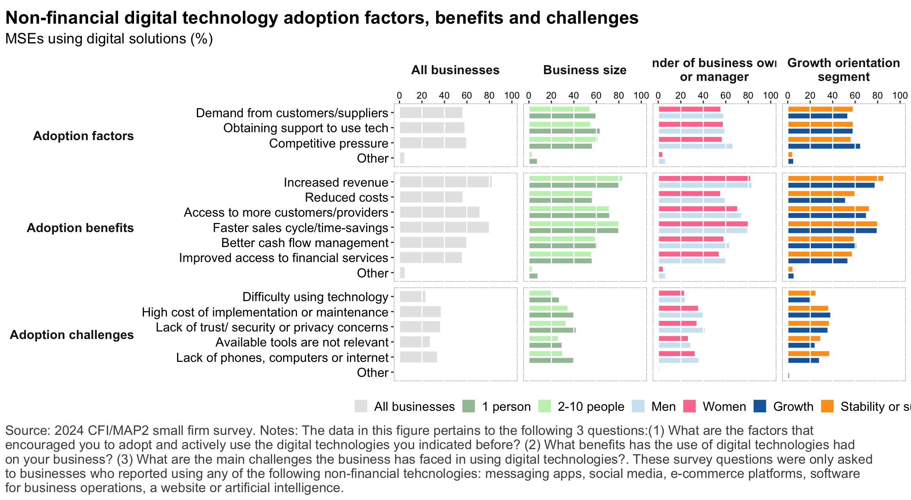{#fig-tech_adoptionfactors width=1152}
:::
:::

::: {.cell}
::: {.cell-output-display}
{#fig-reg_revprhr_digtechusecase width=1152}
:::
:::

::: {.cell}
::: {.cell-output-display}
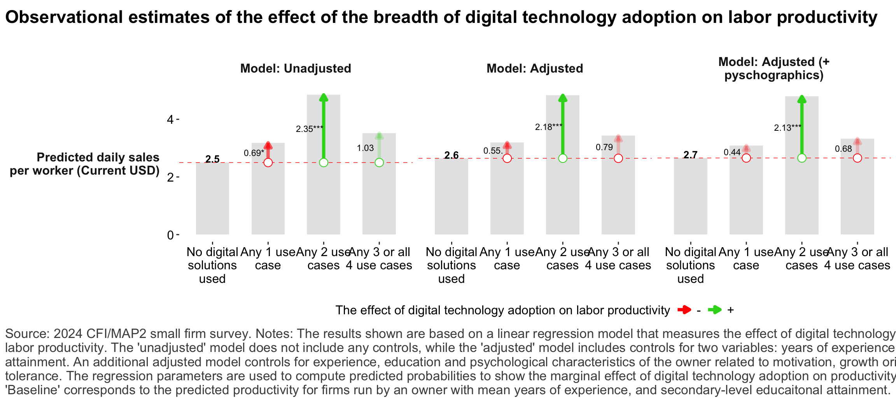{#fig-reg_revprhr_digtechdepth width=1152}
:::
:::

## Risks and Resilience

::: {.cell}
::: {.cell-output-display}
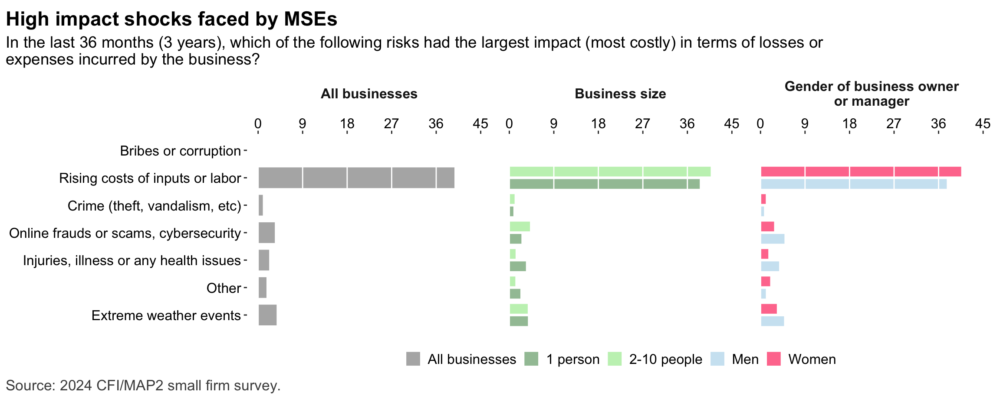{#fig-risks_types width=1152}
:::
:::

::: {.cell}
::: {.cell-output-display}
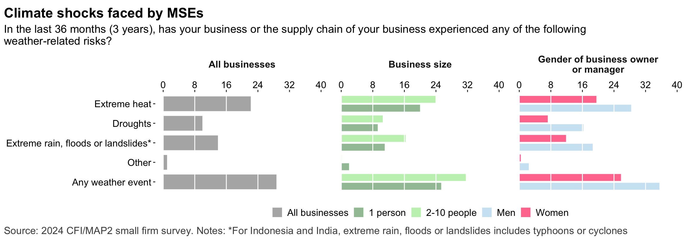{#fig-risks_climate_types width=1152}
:::
:::

::: {.cell}
::: {.cell-output-display}
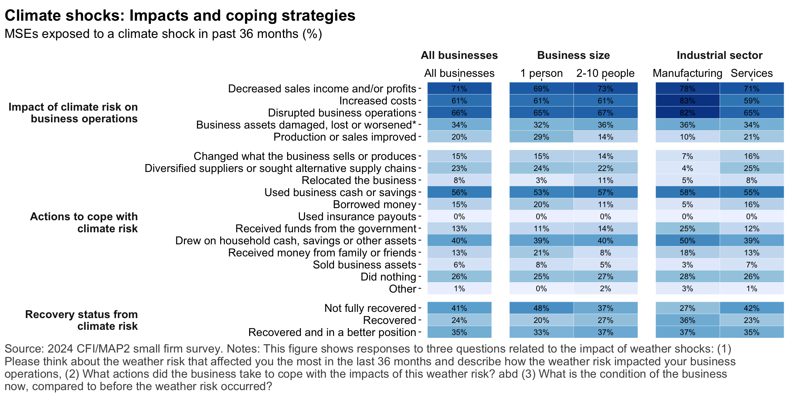{#fig-risks_impacts width=1152}
:::
:::

::: {.cell}
::: {.cell-output-display}
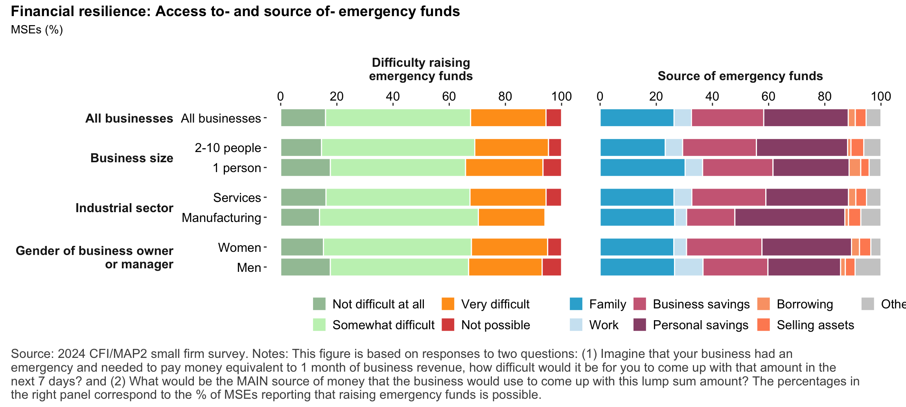{#fig-resilience_financial width=1152}
:::
:::

::: {.cell}
::: {.cell-output-display}
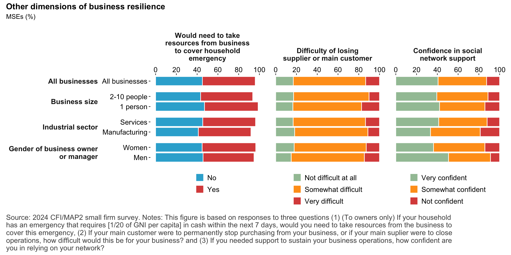{#fig-resilience_nonfinancial width=1152}
:::
:::

::: {.cell}
::: {.cell-output-display}
{#fig-resilience_overview width=1152}
:::
:::

