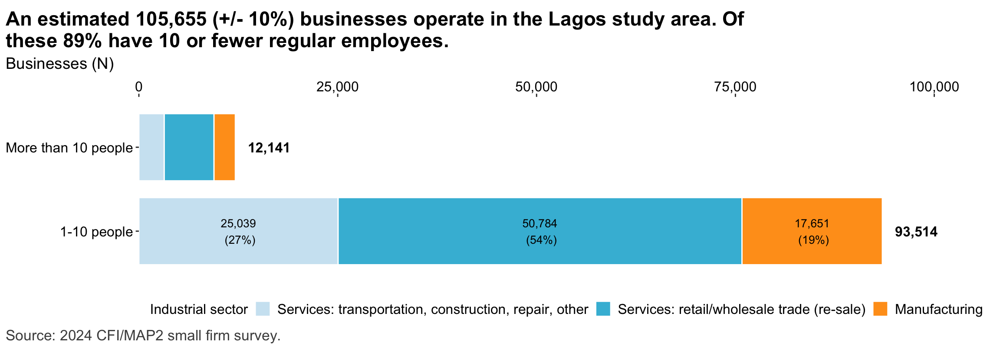
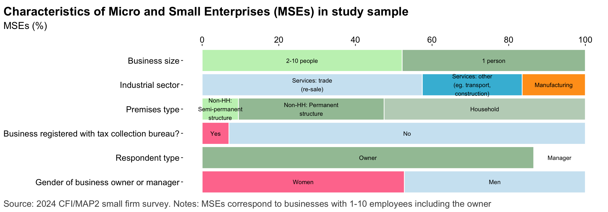
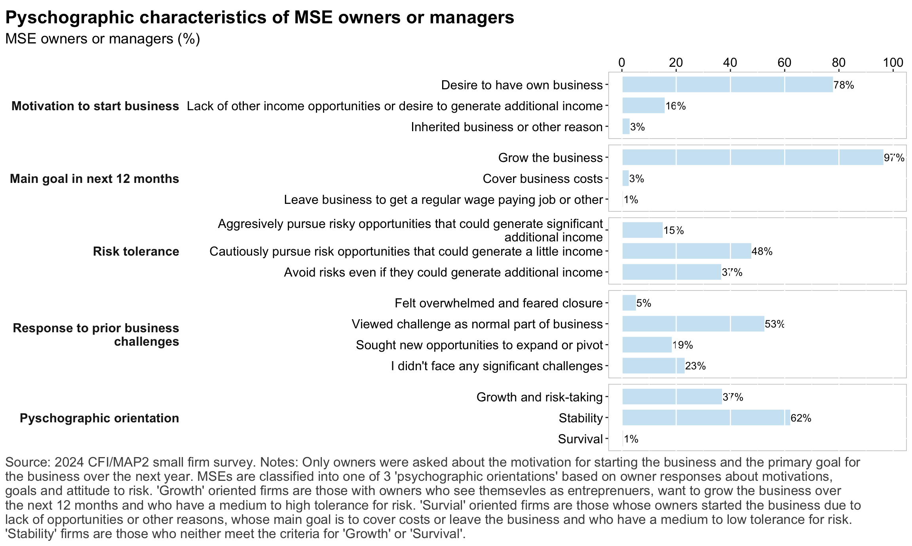
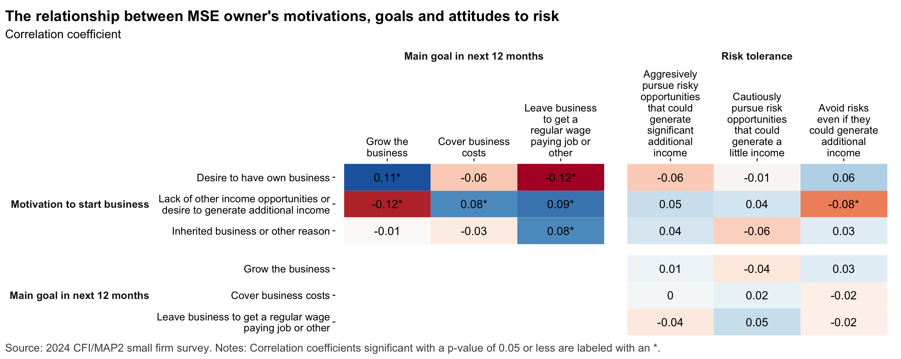
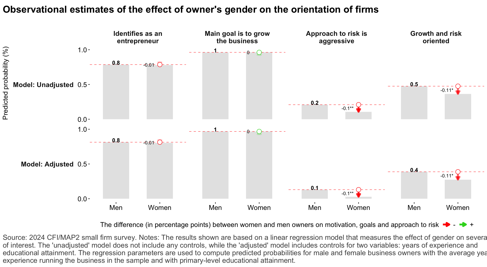
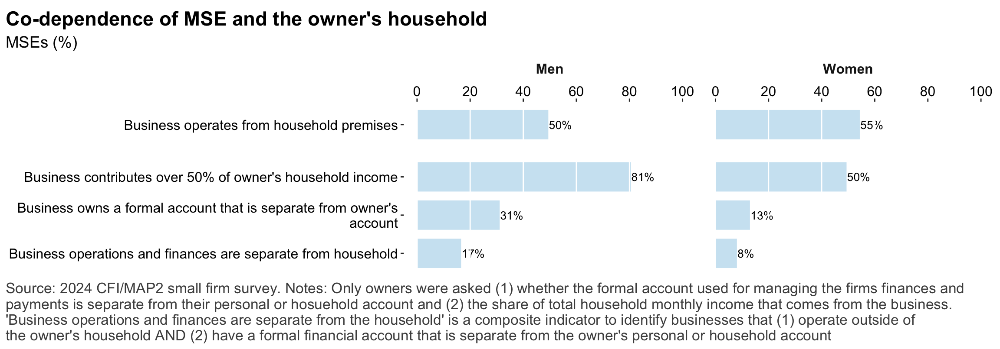
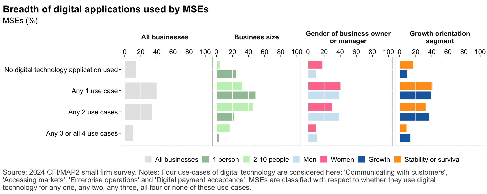
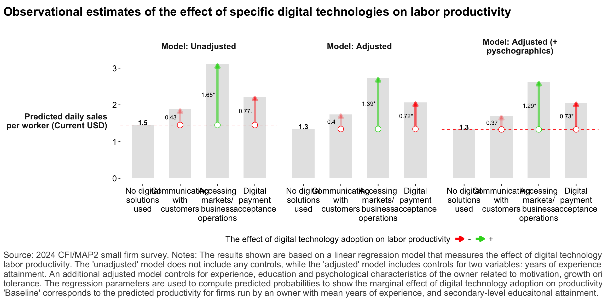
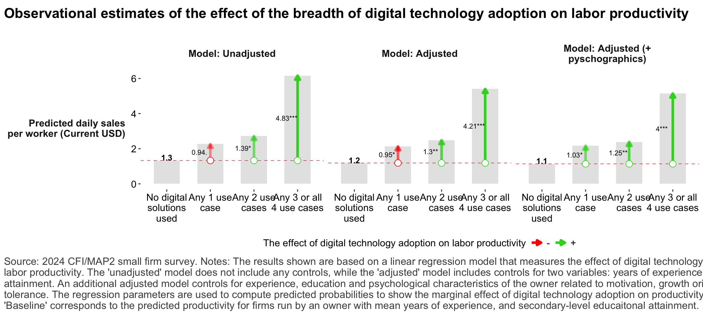

## Fieldwork summary

  * Enumeration was completed in 58 out of 100 initial sampled blocks.
  * 22 of the 58 initial sampled blocks enumerated resulted in expansion to adjacent blocks
  * 132 blocks (including both initial sampled and expansion blocks) were enumerated. 
  * In total, 2582 business were found during enumeration
  * Of all businesses, 2\,273 \(88%\) were eligible for the study
  * Of eligible businesses, 884 \(39%\) were selected at random for interview
  * Of selected businesses, 808 \(91%\) were successfully interviewed 
  * Successful interviews originate from 40 initial sampled blocks

## The business landscape 

::: {.cell}
::: {.cell-output-display}
{#fig-nbus_size_and_sector width=1152}
:::
:::
::: {.cell}
::: {.cell-output-display}
{#fig-mse_chars width=1152}
:::
:::

::: {.cell}
::: {.cell-output-display}
{#fig-mses_size_and_sector width=1152}
:::
:::

::: {.cell}
::: {.cell-output-display}
{#fig-mses_chars_bygender width=1152}
:::
:::

## The small firm owner

::: {.cell}
::: {.cell-output-display}
{#fig-mse_owner_chars width=1152}
:::
:::

::: {.cell}
::: {.cell-output-display}
{#fig-mse_owner_psych width=1152}
:::
:::

::: {.cell}
::: {.cell-output-display}
{#fig-resp_psyc_corr width=1152}
:::
:::

::: {.cell}
::: {.cell-output-display}
{#fig-reg_growth_gender width=1152}
:::
:::

::: {.cell}
::: {.cell-output-display}
{#fig-mse_hh_owner width=1152}
:::
:::

## Digital technology 

::: {.cell}
::: {.cell-output-display}
{#fig-digtech_divide width=1152}
:::
:::

::: {.cell}
::: {.cell-output-display}
{#fig-digtech_usage width=1152}
:::
:::

::: {.cell}
::: {.cell-output-display}
{#fig-digtech_use_depth width=1152}
:::
:::

::: {.cell}
::: {.cell-output-display}
{#fig-reg_revprhr_digtechusecase width=1152}
:::
:::

::: {.cell}
::: {.cell-output-display}
{#fig-reg_revprhr_digtechdepth width=1152}
:::
:::

