## The business landscape


::: {.cell .caption-margin}
::: {.cell-output-display}
{#fig-nbus_size_and_sector width=1152}
:::
:::


------------------------------------------------------------------------


::: {.cell .caption-margin}
::: {.cell-output-display}
{#fig-nbus_sector width=1152}
:::
:::


------------------------------------------------------------------------


::: {.cell .caption-margin}
::: {.cell-output-display}
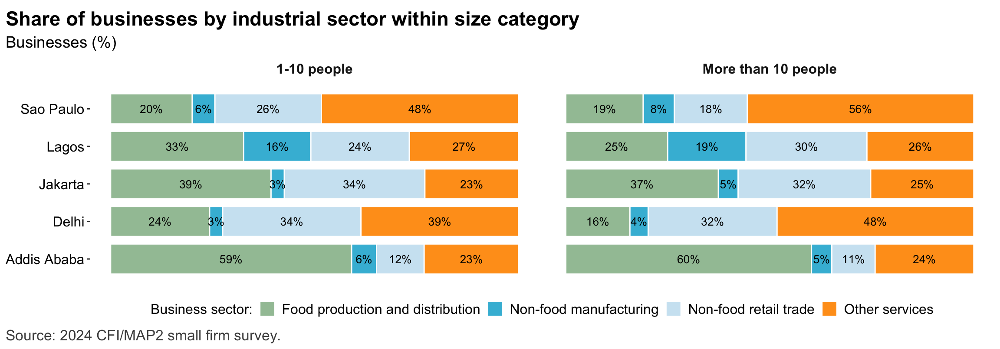{#fig-nbus_sector_custom width=1152}
:::
:::


------------------------------------------------------------------------


::: {.cell .caption-margin}
::: {.cell-output-display}
{#fig-sample_chars width=1152}
:::
:::


------------------------------------------------------------------------


::: {.cell .caption-margin}
::: {.cell-output-display}
{#fig-mse_sector width=1152}
:::
:::


---


::: {.cell .caption-margin}
::: {.cell-output-display}
{#fig-mses_productivity width=1152}
:::
:::


---


::: {.cell .caption-margin}
::: {.cell-output-display}
{#fig-mse_perf_subj width=1152}
:::
:::


## The small business owner


::: {.cell .caption-margin}
::: {.cell-output-display}
{#fig-mse_owner_chars width=1152}
:::
:::


------------------------------------------------------------------------


::: {.cell .caption-margin}
::: {.cell-output-display}
{#fig-mse_owner_psych width=1152}
:::
:::

::: {.cell .caption-margin}
::: {.cell-output-display}
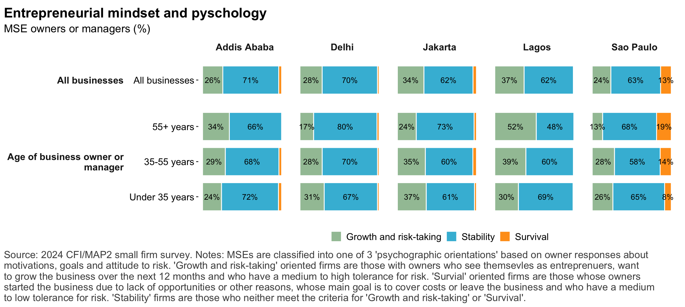{#fig-mse_owner_psych_v2 width=1152}
:::
:::


------------------------------------------------------------------------


::: {.cell .caption-margin}
::: {.cell-output-display}
{#fig-reg_growth_gender width=1152}
:::
:::


---

## Digital technology strands


::: {.cell .caption-margin}
::: {.cell-output-display}
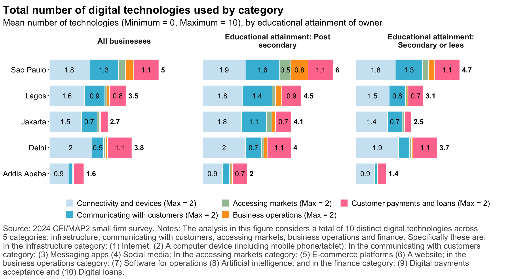{#fig-digital_strands width=1152}
:::
:::


## Digital technology


::: {.cell .caption-margin}
::: {.cell-output-display}
{#fig-digtech_overview width=1152}
:::
:::


------------------------------------------------------------------------


::: {.cell .caption-margin}
::: {.cell-output-display}
{#fig-reg_digtech_drivers width=1152}
:::
:::


------------------------------------------------------------------------


::: {.cell .caption-margin}
::: {.cell-output-display}
{#fig-digtech_usecases width=1152}
:::
:::


------------------------------------------------------------------------


::: {.cell .caption-margin}
::: {.cell-output-display}
{#fig-digtech_use_depth width=1152}
:::
:::


------------------------------------------------------------------------


::: {.cell .caption-margin}
::: {.cell-output-display}
{#fig-tech_adoptionfactors width=1152}
:::
:::


------------------------------------------------------------------------


::: {.cell .caption-margin}
::: {.cell-output-display}
{#fig-reg_revprhr_internet width=1152}
:::
:::


------------------------------------------------------------------------


::: {.cell .caption-margin}
::: {.cell-output-display}
{#fig-reg_revprhr_digitaladoption width=1152}
:::
:::


------------------------------------------------------------------------


::: {.cell .caption-margin}
::: {.cell-output-display}
{#fig-reg_growth_digtech width=1152}
:::
:::


------------------------------------------------------------------------


::: {.cell .caption-margin}
::: {.cell-output-display}
{#fig-reg_revprhr_digtechusecase width=1152}
:::
:::


------------------------------------------------------------------------


::: {.cell .caption-margin}
::: {.cell-output-display}
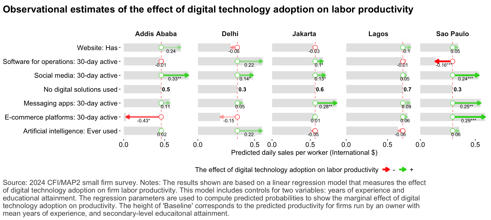{#fig-reg_subjfactors_digtechusecase width=1152}
:::
:::


------------------------------------------------------------------------


::: {.cell .caption-margin}
::: {.cell-output-display}
{#fig-reg_revprhr_digtechdepth width=1152}
:::
:::


## Financial services


::: {.cell .caption-margin}
::: {.cell-output-display}
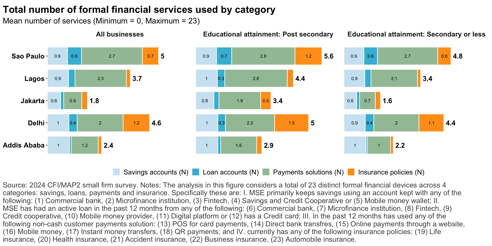{#fig-account_strands width=1152}
:::
:::


---


::: {.cell .caption-margin}
::: {.cell-output-display}
{#fig-account_ownership width=1152}
:::
:::


------------------------------------------------------------------------


::: {.cell .caption-margin}
::: {.cell-output-display}
{#fig-payments width=1152}
:::
:::


------------------------------------------------------------------------


::: {.cell .caption-margin}
::: {.cell-output-display}
{#fig-credit_demand width=1152}
:::
:::


------------------------------------------------------------------------


::: {.cell .caption-margin}
::: {.cell-output-display}
{#fig-credit_denied width=1152}
:::
:::


------------------------------------------------------------------------


::: {.cell .caption-margin}
::: {.cell-output-display}
{#fig-dfs_impacts width=1152}
:::
:::


------------------------------------------------------------------------


::: {.cell .caption-margin}
::: {.cell-output-display}
{#fig-ins width=1152}
:::
:::


------------------------------------------------------------------------


::: {.cell .caption-margin}
::: {.cell-output-display}
{#fig-reg_revprhr_finserv width=1152}
:::
:::


------------------------------------------------------------------------


::: {.cell .caption-margin}
::: {.cell-output-display}
{#fig-reg_resilience_finserv width=1152}
:::
:::

::: {.cell .caption-margin}
::: {.cell-output-display}
{#fig-reg_growth_finserv width=1152}
:::
:::

::: {.cell .caption-margin}
::: {.cell-output-display}
{#fig-reg_capex_finserv width=1152}
:::
:::


## Consumer protection


::: {.cell .caption-margin}
::: {.cell-output-display}
{#fig-cp_loanrepayment width=1152}
:::
:::


------------------------------------------------------------------------


::: {.cell .caption-margin}
::: {.cell-output-display}
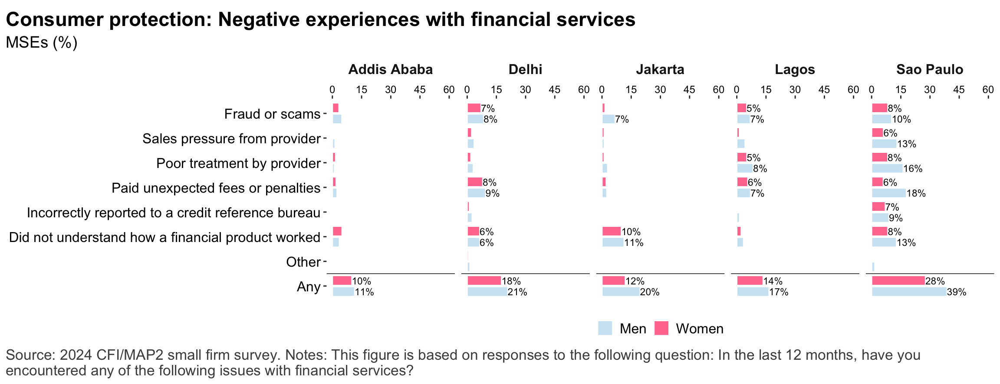{#fig-cp_issues_1 width=1152}
:::
:::

::: {.cell .caption-margin}
::: {.cell-output-display}
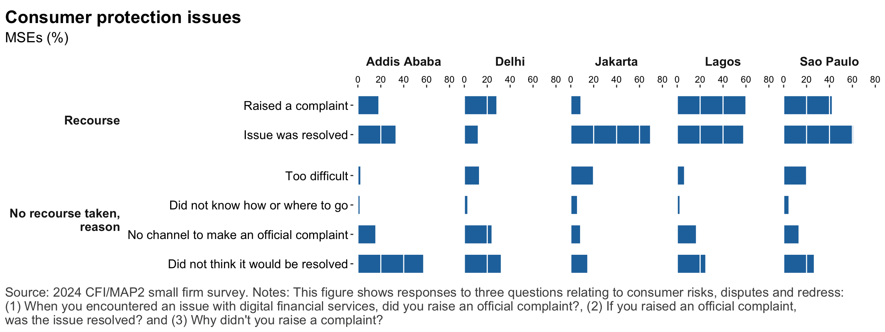{#fig-cp_issues_2 width=1152}
:::
:::

::: {.cell .caption-margin}
::: {.cell-output-display}
{#fig-cp_drivers width=1152}
:::
:::

::: {.cell .caption-margin}
::: {.cell-output-display}
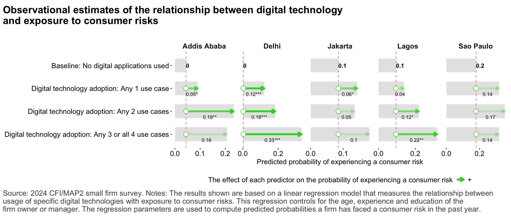{#fig-cp_drivers_dig_v1 width=1152}
:::
:::

::: {.cell .caption-margin}
::: {.cell-output-display}
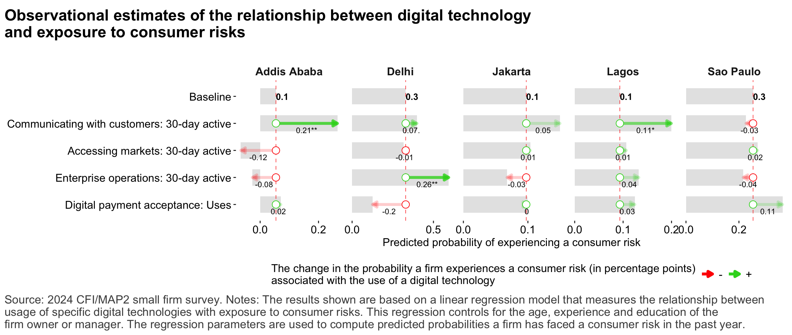{#fig-cp_drivers_dig_v2 width=1152}
:::
:::

::: {.cell .caption-margin}
::: {.cell-output-display}
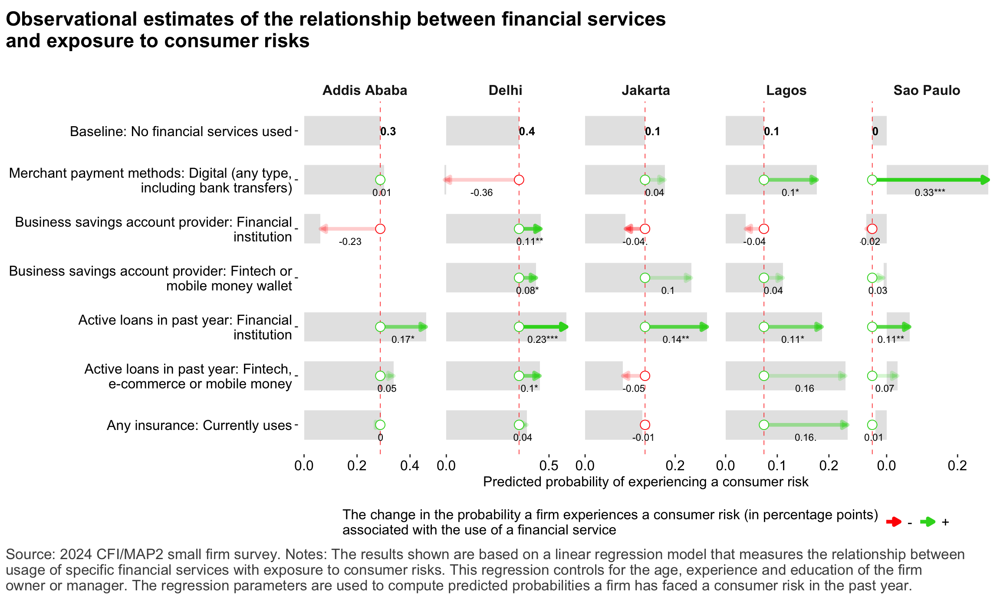{#fig-cp_drivers_fin width=1152}
:::
:::

::: {.cell}

```{.r .cell-code}
#| label: fig-reg_cp_digtech
#| echo: false
#| warning: false
#| fig-cap: "Relationship between depth of digital technology adoption and exposure to consumer protection risks"
#| cap-location: margin
 
fig_notes <- "Notes: The results shown are based on a linear regression model that measures the effect of combined use of digital technology applications on consumer protection risks. This model includes controls for two variables: years of experience and educational attainment of the owner or manager of the firm. The regression parameters are used to compute predicted probabilities to show the marginal effect of digital technology adoption on productivity. The height of 'Baseline' corresponds to the predicted productivity for firms run by an owner with mean years of experience, and secondary-level educaitonal attainment."
 
# Defining regressions

  depvars <- c("cp_exposure_score")
  depvar_labels <- INDICATORS[depvars]
  maineffects <- c("tech_cat_any1", "tech_cat_any2", "tech_cat_any3all4")
  effect_labels <- c("(Intercept)" = "No digital solutions used", INDICATORS[maineffects])

  confounds <- c("resp_experience_c", "resp_education_agg4_shc_non", "resp_education_agg4_shc_pri",  "resp_education_agg4_shc_trt", "resp_maingoal_grow", "resp_riskapproach_aggr")
  confounds2 <- c("resp_experience_c", "resp_education_agg4_shc_non", "resp_education_agg4_shc_pri",  "resp_education_agg4_shc_trt", "psych_mca_dim1", "psych_mca_dim2")

combinations <- expand.grid(depvars, COUNTRIES, stringsAsFactors = FALSE)
depvars <- combinations[[1]]
countries <- combinations[[2]]

# Running regressions

ests <- bind_rows(
    #map(depvars, model_and_prepfig, maineffects, confounds = NULL, data = main_data_all, depvar_labels, effect_labels),
    map2(depvars, countries, model_and_prepfig, maineffect = maineffects, confounds = confounds, data = main_data_all, depvar_labels = depvar_labels, effect_labels = effect_labels,  depvarlog = FALSE)
  )
```

::: {.cell-output .cell-output-stderr}

```
NOTE: 76 observations removed because of NA values (LHS: 12, RHS: 67).
```


:::

::: {.cell-output .cell-output-stderr}

```
NOTE: 370 observations removed because of NA values (LHS: 238, RHS: 195).
```


:::

::: {.cell-output .cell-output-stderr}

```
NOTE: 103 observations removed because of NA values (LHS: 2, RHS: 103).
```


:::

::: {.cell-output .cell-output-stderr}

```
NOTE: 169 observations removed because of NA values (LHS: 38, RHS: 144).
```


:::

::: {.cell-output .cell-output-stderr}

```
NOTE: 60 observations removed because of NA values (LHS: 20, RHS: 43).
```


:::

```{.r .cell-code}
factor_params <- list(
  wrap_sizes = list(depvar_label = 60, effect_label = 70, model_type = 25), 
  reverse_order = list(depvar_label = TRUE, effect_label = FALSE, model_type = FALSE), 
  order_vars = list(depvar_label = NULL, effect_label = NULL, model_type = NULL)
)
 
fig_data <- prep_reg_data(prep_reg_factors(ests, factor_params, include_valuelabel = FALSE),  depvarlog = FALSE) %>% 
  mutate(effect_label = str_replace(effect_label, "Digital technology adoption: ", ""))
 
 
labels <- list(
      title = "Observational estimates of the effect of the breadth of\ndigital technology adoption on exposure to consumer risks",
      subtitle = "",
       y = "Consumer protection risk exposure score",
      x = NULL,
      caption = str_wrap(paste(SOURCE, fig_notes), CAP_WRAP)
    )
 
barparams <- list(
  bars = list(width = 0.6, color = "grey90"), 
  valuelabels = list(show = FALSE, lab_vjust = 0, lab_hjust = 0, lab_ndgy = 0, lab_ndgx = 0.25, lab_face = "plain", lab_size = 3), 
  arrowlabels = list(show = TRUE, lab_vjust = 0.5, lab_hjust = 0.5, lab_ndgy = 0, lab_ndgx = -0.15,  lab_face = "plain", lab_size = 3), 
  baselinelabel = list(show = TRUE, lab_vjust = 0.5, lab_hjust = 0, lab_ndgy = 0.01, lab_ndgx = 0,  lab_face = "bold", lab_size = 3.5)
)
 
facets <- list(type = "wrap", 
                rows ="city", 
                cols = "city", 
                scales = "free_x", 
                space = "free", 
                drop_row_label = FALSE)
 
  miny <- round(min(fig_data$fig_data), 2) 
  maxy <- round(max(fig_data$fig_data), 2) 
  buffer <- (maxy - miny)/100
  miny <- miny - buffer*4
  if (miny > 0) { miny <- 0 }
  maxy <- maxy + buffer*4

scales <- list(
  y = list(limits = NULL, position = "left", nbreaks = 3), 
  x = list(position = "bottom")
)
 
fig_regests(fig_data, labels, facets = facets, barparams, scales, effect_desc = "The effect of digital technology adoption on consumer risks", coord_flip = TRUE)
```

::: {.cell-output .cell-output-stderr}

```
Warning: Removed 5 rows containing missing values or values outside the scale range
(`geom_hline()`).
```


:::

::: {.cell-output .cell-output-stderr}

```
Warning: Removed 5 rows containing missing values or values outside the scale range
(`geom_segment()`).
```


:::

::: {.cell-output .cell-output-stderr}

```
Warning: Removed 5 rows containing missing values or values outside the scale range
(`geom_point()`).
```


:::

::: {.cell-output .cell-output-stderr}

```
Warning: Removed 5 rows containing missing values or values outside the scale range
(`geom_text()`).
```


:::

::: {.cell-output .cell-output-stderr}

```
Warning: Removed 15 rows containing missing values or values outside the scale range
(`geom_text()`).
```


:::

::: {.cell-output-display}
{width=1152}
:::
:::

 
 
## Risks and Resilience


::: {.cell .caption-margin}
::: {.cell-output-display}
{#fig-risks_types width=1152}
:::
:::


------------------------------------------------------------------------


::: {.cell .caption-margin}
::: {.cell-output-display}
{#fig-risks_climate_types width=1152}
:::
:::


------------------------------------------------------------------------


::: {.cell .caption-margin}
::: {.cell-output-display}
{#fig-risks_impacts width=1152}
:::
:::


------------------------------------------------------------------------


::: {.cell .caption-margin}
::: {.cell-output-display}
{#fig-resilience_financial width=1152}
:::
:::


------------------------------------------------------------------------


::: {.cell .caption-margin}
::: {.cell-output-display}
{#fig-resilience_nonfinancial width=1152}
:::
:::


------------------------------------------------------------------------


::: {.cell .caption-margin}
::: {.cell-output-display}
{#fig-resilience_overview width=1152}
:::
:::


------------------------------------------------------------------------


::: {.cell .caption-margin}
::: {.cell-output-display}
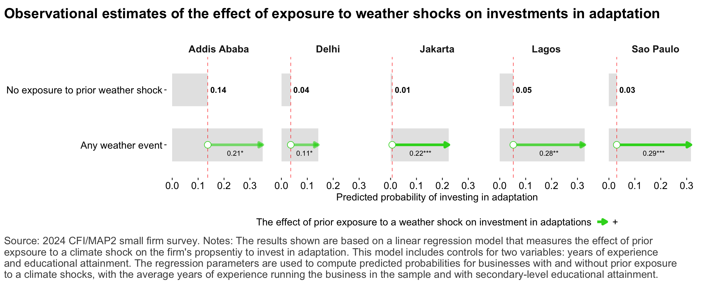{#fig-reg_climrisk_adaptation width=1152}
:::
:::

::: {.cell .caption-margin}
::: {.cell-output-display}
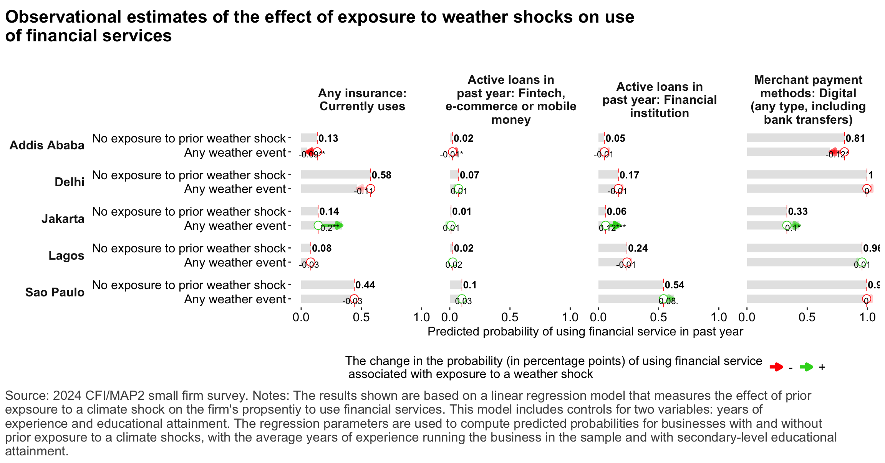{#fig-reg_climrisk_finserv width=1152}
:::
:::

::: {.cell .caption-margin}
::: {.cell-output-display}
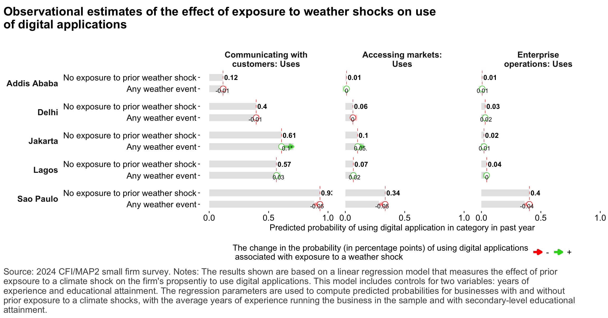{#fig-reg_climrisk_digtools width=1152}
:::
:::

::: {.cell .caption-margin}
::: {.cell-output-display}
{#fig-reg_digtech_resilience width=1152}
:::
:::


## Annex


::: {.cell .caption-margin}
::: {.cell-output-display}
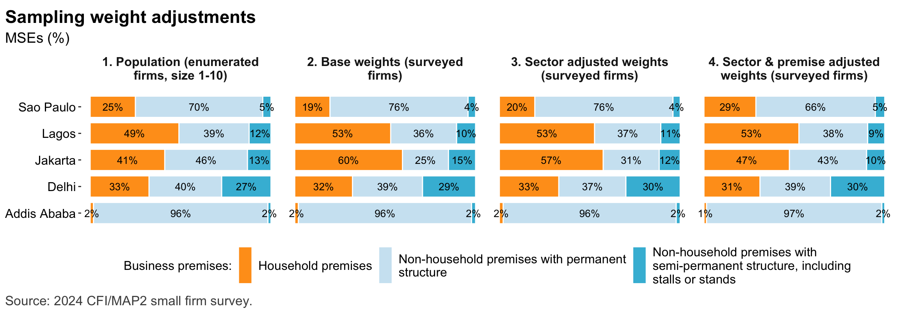{#fig-sampling_adjustments_premise width=1152}
:::
:::


---


::: {.cell .caption-margin}
::: {.cell-output-display}
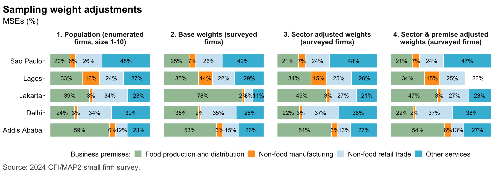{#fig-sampling_adjustments_sector width=1152}
:::
:::
