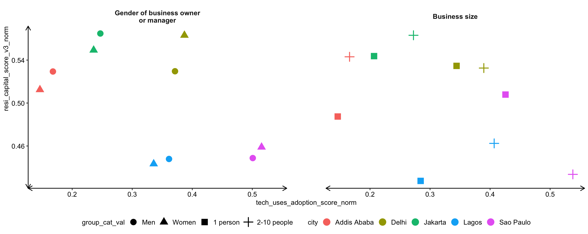
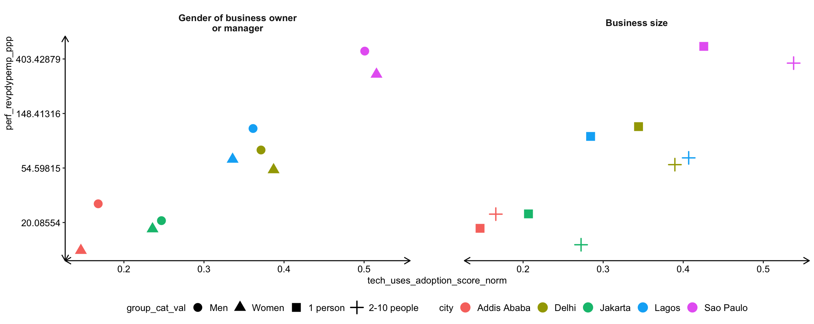
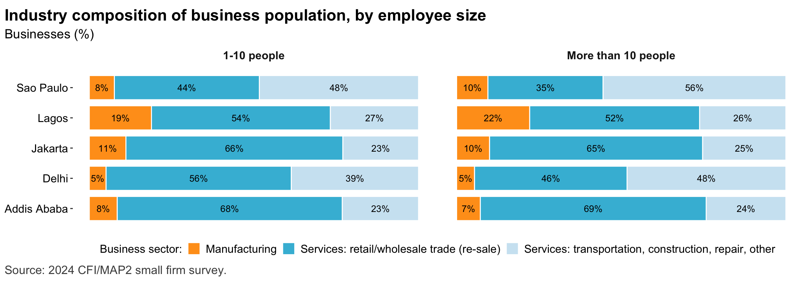
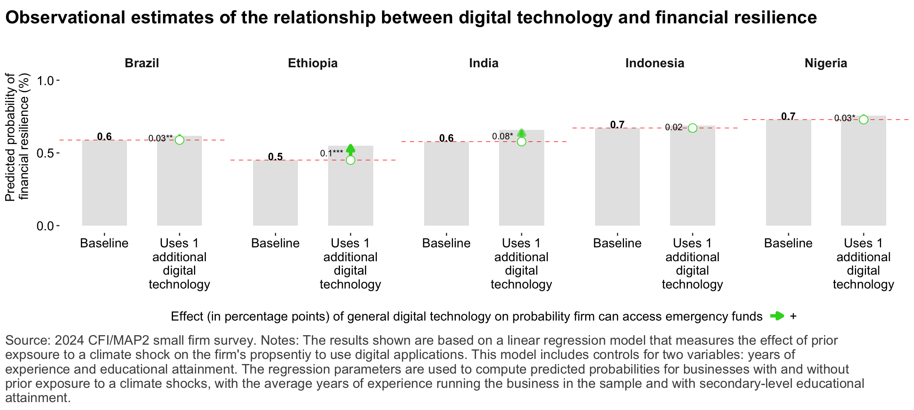
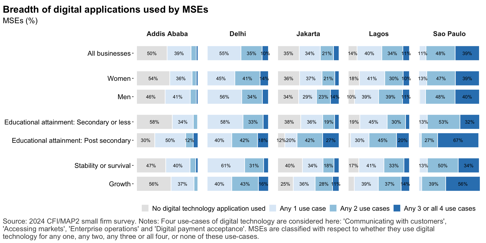
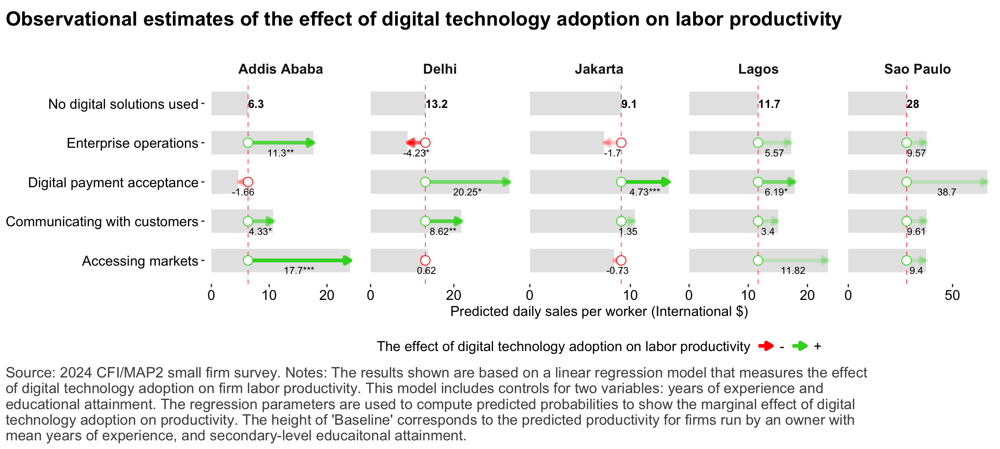
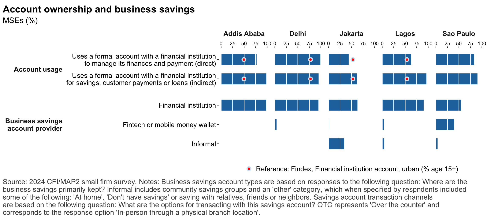
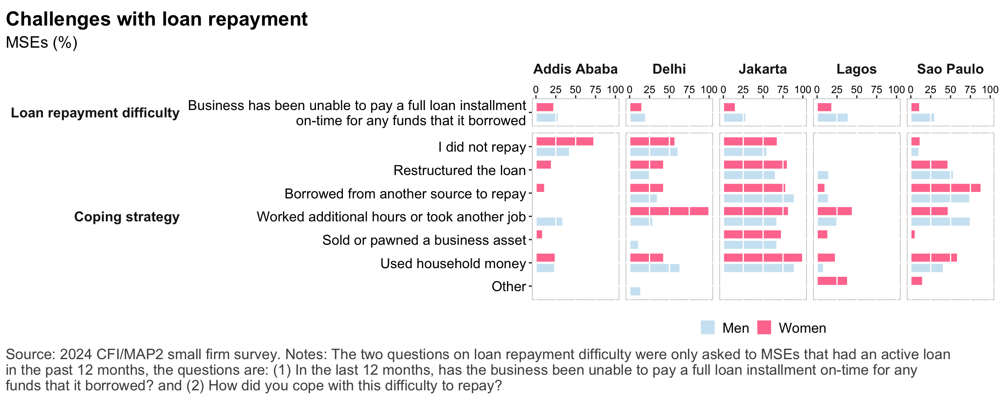
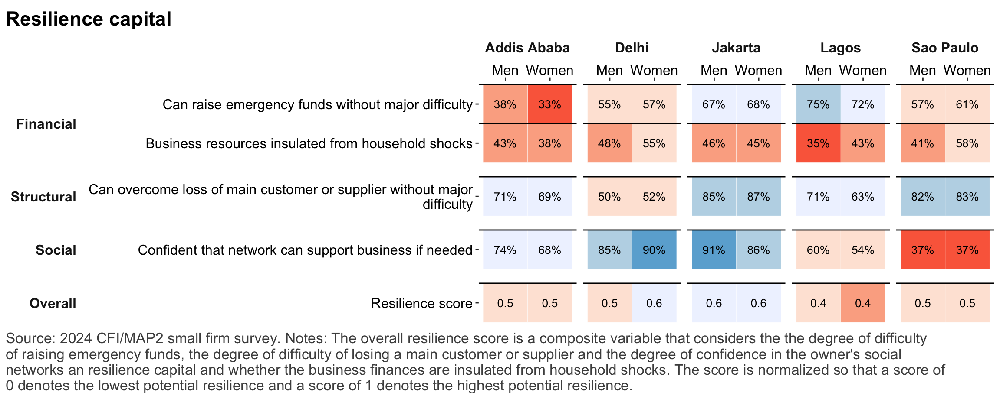

## Key messages

::: {.cell .caption-margin}
::: {.cell-output-display}
{#fig-key_mess_1 width=1152}
:::
:::

::: {.cell .caption-margin}
::: {.cell-output-display}
{#fig-key_mess_2 width=1152}
:::
:::

## The business landscape 

::: {.cell .caption-margin}
::: {.cell-output-display}
{#fig-nbus_size_and_sector width=1152}
:::
:::

---

::: {.cell .caption-margin}
::: {.cell-output-display}
{#fig-nbus_sector width=1152}
:::
:::

---

::: {.cell .caption-margin}
::: {.cell-output-display}
{#fig-sample_chars width=1152}
:::
:::

---

::: {.cell .caption-margin}
::: {.cell-output-display}
{#fig-mse_sector width=1152}
:::
:::

---

::: {.cell .caption-margin}
::: {.cell-output-display}
{#fig-mses_productivity width=1152}
:::
:::

---

::: {.cell .caption-margin}
::: {.cell-output-display}
{#fig-mse_perf_subj width=1152}
:::
:::

## The small business owner 

::: {.cell .caption-margin}
::: {.cell-output-display}
{#fig-mse_owner_chars width=1152}
:::
:::

---

::: {.cell .caption-margin}
::: {.cell-output-display}
{#fig-mse_owner_psych width=1152}
:::
:::

---

::: {.cell .caption-margin}
::: {.cell-output-display}
{#fig-reg_growth_gender width=1152}
:::
:::

## Digital technology 

::: {.cell .caption-margin}
::: {.cell-output-display}
{#fig-digtech_overview width=1152}
:::
:::

---

::: {.cell .caption-margin}
::: {.cell-output-display}
{#fig-reg_digtech_drivers width=1152}
:::
:::

---

::: {.cell .caption-margin}
::: {.cell-output-display}
{#fig-reg_digtech_resilience width=1152}
:::
:::

::: {.cell .caption-margin}
::: {.cell-output-display}
{#fig-digtech_usecases width=1152}
:::
:::

::: {.cell .caption-margin}
::: {.cell-output-display}
{#fig-digtech_use_depth width=1152}
:::
:::

::: {.cell .caption-margin}
::: {.cell-output-display}
{#fig-tech_adoptionfactors width=1152}
:::
:::

::: {.cell .caption-margin}
::: {.cell-output-display}
{#fig-reg_revprhr_digtechusecase width=1152}
:::
:::

::: {.cell .caption-margin}
::: {.cell-output-display}
{#fig-reg_revprhr_digtechdepth width=1152}
:::
:::

## Financial services 

::: {.cell .caption-margin}
::: {.cell-output-display}
{#fig-account_ownership width=1152}
:::
:::

--- 

::: {.cell .caption-margin}
::: {.cell-output-display}
{#fig-payments width=1152}
:::
:::

---

::: {.cell .caption-margin}
::: {.cell-output-display}
{#fig-credit_demand width=1152}
:::
:::

---

::: {.cell .caption-margin}
::: {.cell-output-display}
{#fig-credit_denied width=1152}
:::
:::

--- 

::: {.cell .caption-margin}
::: {.cell-output-display}
{#fig-dfs_impacts width=1152}
:::
:::

## Consumer protection

::: {.cell .caption-margin}
::: {.cell-output-display}
{#fig-cp_loanrepayment width=1152}
:::
:::

--- 

::: {.cell .caption-margin}
::: {.cell-output-display}
{#fig-cp_issues width=1152}
:::
:::

## Risks and Resilience

::: {.cell .caption-margin}
::: {.cell-output-display}
{#fig-risks_types width=1152}
:::
:::

--- 

::: {.cell .caption-margin}
::: {.cell-output-display}
{#fig-risks_climate_types width=1152}
:::
:::

--- 

::: {.cell .caption-margin}
::: {.cell-output-display}
{#fig-risks_impacts width=1152}
:::
:::

---

::: {.cell .caption-margin}
::: {.cell-output-display}
{#fig-resilience_financial width=1152}
:::
:::

--- 

::: {.cell .caption-margin}
::: {.cell-output-display}
{#fig-resilience_nonfinancial width=1152}
:::
:::

---

::: {.cell .caption-margin}
::: {.cell-output-display}
{#fig-resilience_overview width=1152}
:::
:::

---

::: {.cell .caption-margin}
::: {.cell-output-display}
{#fig-reg_resilience_digtechadoption width=1152}
:::
:::
