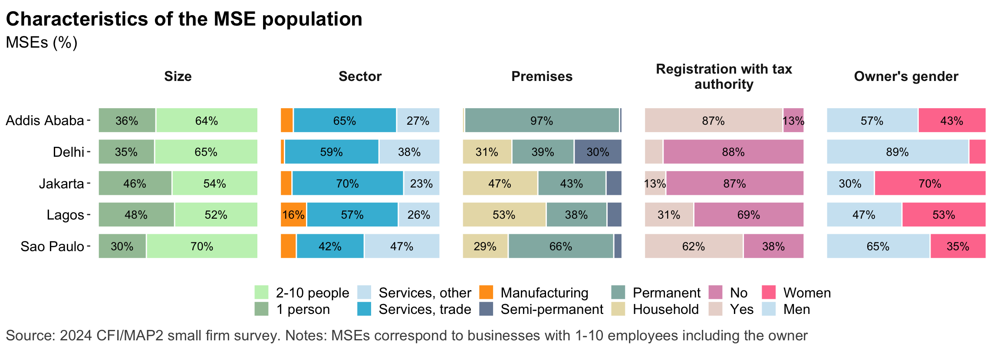
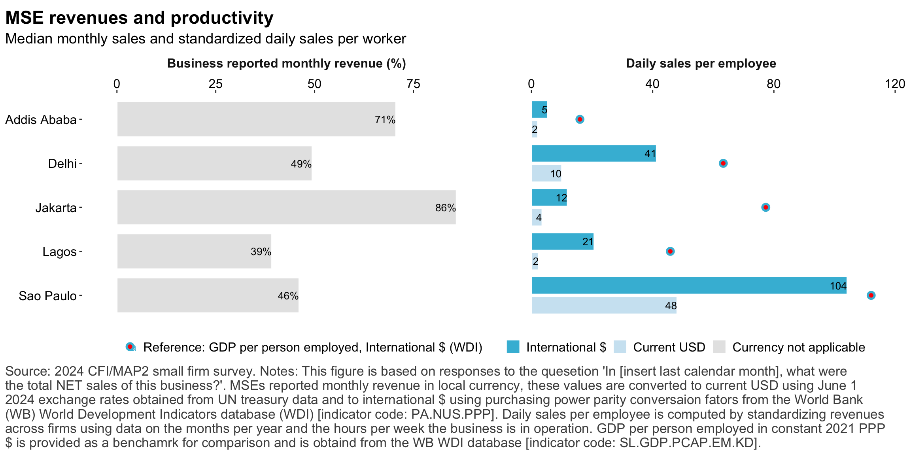
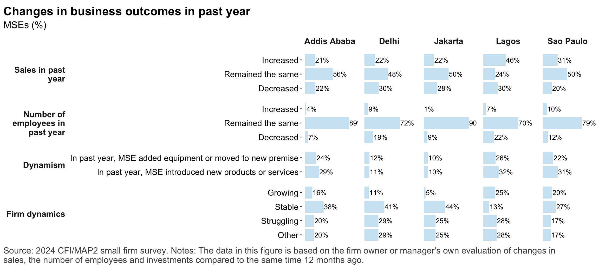
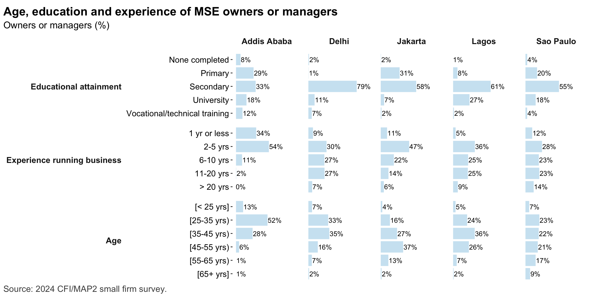
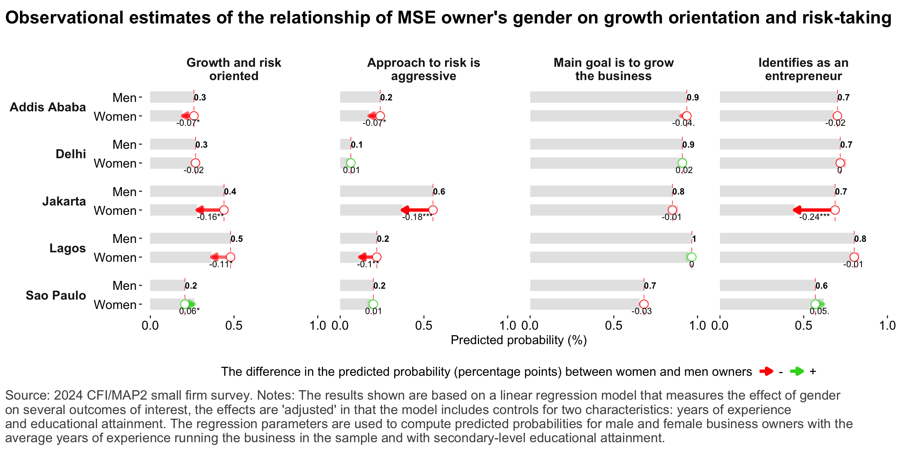
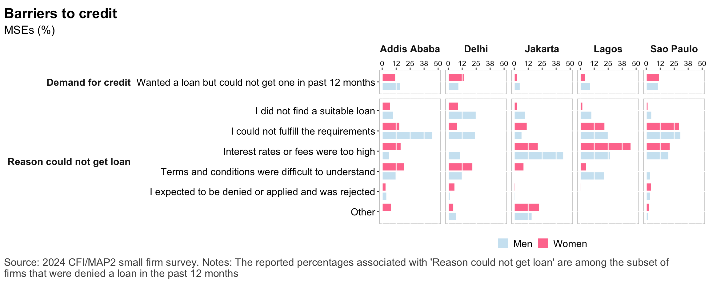
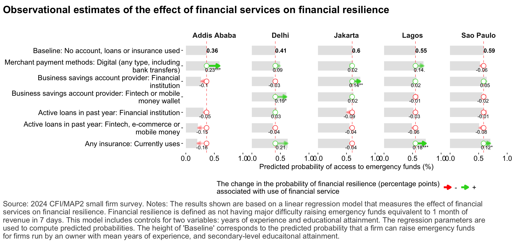
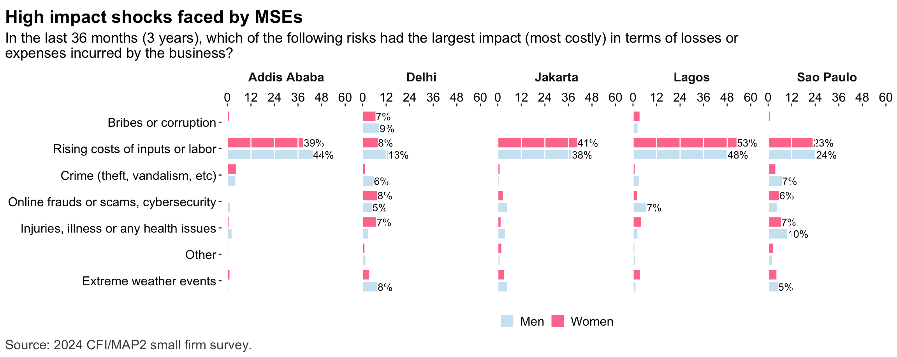
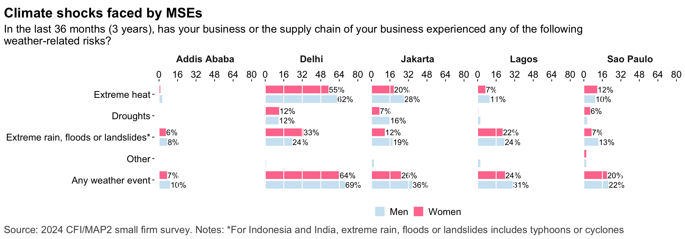
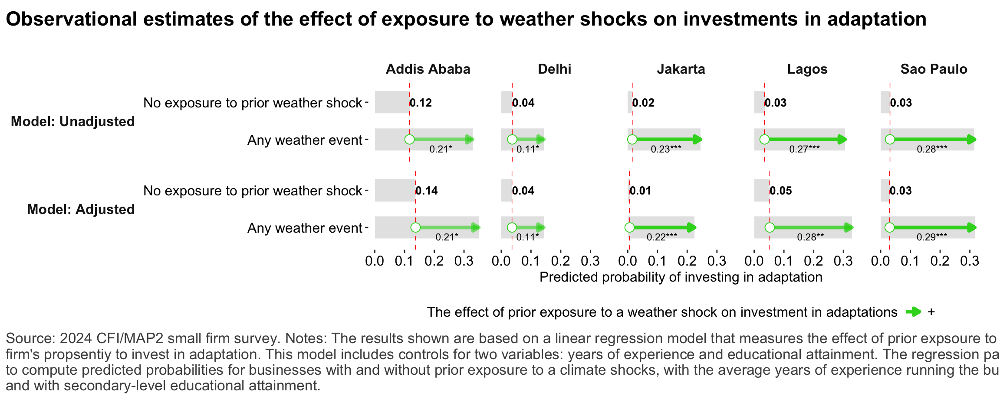

## Key findings

*	This study found between 400 (Addis) and 1,400 (Delhi) visible businesses establishments per square kilometer in 5 major urban centers (@fig-nbus_size_and_sector). 

*	A dominant majority of these visible business establishments are businesses with fewer than 10 workers (Figure 1), though Delhi has a relatively high concentration of larger businesses (40%). 

*	These small businesses are concentrated in retail trade and play a key role in urban food production and distribution. In Jakarta, 76 percent of small firms are involved in food distribution or manufacture, whereas in Addis, Delhi and Lagos, the share ranges from 34 to 47 percent, in Sao Paolo production is more diversified and the share of firms in food distribution or manufcature is lower, making up 25 percent. Among the 5 cities, Lagos has the highest share of small businesses in manufacturing (19%). 

*	At the median, the productivity per worker among these small firms is lower than the productivity suggested by national averages, but the gap is smallest in Sao Paulo (0.95x) and largest in Jakarta (0.13x) (@fig-mses_productivity)

* Based on owner’s or manager’s evaluations, the share of small firms can be described as ‘growing’ is as low as 4 percent in Jakarta and as high as 25 percent in Lagos. Firms that can be described as ‘static’, that is, revenues and number of employees that have stayed the same over the past year and that have not made investments in capital or products make up as high as 45% of firms in Jakarta and as low as 13% of firms in Lagos. 

*	On average, small business owners are in their 30’s (Addis, Delhi) or in their early 40’s (Sao Paolo, Lagos). The least experienced small firm owners are those in Addis (2.8 years’ experience running the business) and the most experienced are those in Sao Paolo (10 years’ of experience). 

*	Nearly 1 in 2 small businesses in Jakarta and Lagos are owner-operated single person businesses, while the share in Addis, Delhi and Sao Paulo is nearer to 1 in 3. The prevalence of single-person businesses correlates strongly with the share of businesses run out of the household and with the share of businesses run by women. Jakarta and Lagos also have the highest share of businesses run out of the household (60 and 53%, respectively) as well as the highest share of businesses run by women (74 and 53%, respectively). 

*	Around 3 in 4 business owners in Addis, Delhi and Lagos said they wanted to become and entrepreneur to start a business. In Sao Paolo and Jakarta, the number is around 1 in 2, and more business owners became entrepreneurs due to lack of opportunities or other reasons. Across all study sites, dominant shares of business owners say their main goal is to grow the business over the next 12 months, however in Brazil a relatively larger share of owners (nearly 1 in 3) say their main goal is to either cover business costs or leave the business. Overall, between 1 in 4 and 1 in 3 business owners can be characterized as having a strong ‘entrepreneurial’ mindset with a desire to grow the business and take risks. 

*	Controlling for education and years of experience, women are less likely to have an ‘entrepreneurial’ or ‘growth and risk’ oriented mindset than men in Addis and Jakarta. In Addis, this finding is driven by a more cautious attitude to risk among women, while in Jakarta in addition to lower risk tolerance, women are substantially less likely than men to identify as an entrepreneur.  

*	This study tracked use of 10 distinct non-financial and financial digital technologies among small businesses. There is wide variation among the study sites in the adoption of these technologies. In Addis, small businesses use 1.6 technologies, whereas in Brazil they use 5, reflecting more widespread adoption of advanced digital solutions such as e-commerce platforms or operations-supporting software  and digital loans. 

*	Educational attainment of the owner (or manager) is the single strongest predictor of firm-level technology and this finding is consistent across all 5 cities. 

## The business landscape 

::: {.cell .caption-margin}
::: {.cell-output-display}
{#fig-nbus_size_and_sector width=1152}
:::
:::

---

::: {.cell .caption-margin}
::: {.cell-output-display}
{#fig-nbus_sector width=1152}
:::
:::

---

::: {.cell .caption-margin}
::: {.cell-output-display}
{#fig-sample_chars width=1152}
:::
:::

---

::: {.cell .caption-margin}
::: {.cell-output-display}
{#fig-mse_sector width=1152}
:::
:::

---

::: {.cell .caption-margin}
::: {.cell-output-display}
{#fig-mses_productivity width=1152}
:::
:::

---

::: {.cell .caption-margin}
::: {.cell-output-display}
{#fig-mse_perf_subj width=1152}
:::
:::

## The small business owner 

::: {.cell .caption-margin}
::: {.cell-output-display}
{#fig-mse_owner_chars width=1152}
:::
:::

---

::: {.cell .caption-margin}
::: {.cell-output-display}
{#fig-mse_owner_psych width=1152}
:::
:::

---

::: {.cell .caption-margin}
::: {.cell-output-display}
{#fig-reg_growth_gender width=1152}
:::
:::

## Digital technology 

::: {.cell .caption-margin}
::: {.cell-output-display}
{#fig-digtech_overview width=1152}
:::
:::

---

::: {.cell .caption-margin}
::: {.cell-output-display}
{#fig-reg_digtech_drivers width=1152}
:::
:::

---

::: {.cell .caption-margin}
::: {.cell-output-display}
{#fig-digtech_usecases width=1152}
:::
:::

---

::: {.cell .caption-margin}
::: {.cell-output-display}
{#fig-digtech_use_depth width=1152}
:::
:::

--- 

::: {.cell .caption-margin}
::: {.cell-output-display}
{#fig-tech_adoptionfactors width=1152}
:::
:::

---

::: {.cell .caption-margin}
::: {.cell-output-display}
{#fig-reg_revprhr_internet width=1152}
:::
:::

--- 

::: {.cell .caption-margin}
::: {.cell-output-display}
{#fig-reg_revprhr_digitaladoption width=1152}
:::
:::

--- 

::: {.cell .caption-margin}
::: {.cell-output-display}
{#fig-reg_growth_digtech width=1152}
:::
:::

--- 

::: {.cell .caption-margin}
::: {.cell-output-display}
{#fig-reg_revprhr_digtechusecase width=1152}
:::
:::

--- 

::: {.cell .caption-margin}
::: {.cell-output-display}
{#fig-reg_revprhr_digtechdepth width=1152}
:::
:::

## Financial services 

::: {.cell .caption-margin}
::: {.cell-output-display}
{#fig-account_ownership width=1152}
:::
:::

--- 

::: {.cell .caption-margin}
::: {.cell-output-display}
{#fig-payments width=1152}
:::
:::

---

::: {.cell .caption-margin}
::: {.cell-output-display}
{#fig-credit_demand width=1152}
:::
:::

---

::: {.cell .caption-margin}
::: {.cell-output-display}
{#fig-credit_denied width=1152}
:::
:::

--- 

::: {.cell .caption-margin}
::: {.cell-output-display}
{#fig-dfs_impacts width=1152}
:::
:::

---

::: {.cell .caption-margin}
::: {.cell-output-display}
{#fig-ins width=1152}
:::
:::

---

::: {.cell .caption-margin}
::: {.cell-output-display}
{#fig-reg_revprhr_finserv width=1152}
:::
:::

---

::: {.cell .caption-margin}
::: {.cell-output-display}
{#fig-reg_resilience_finserv width=1152}
:::
:::

::: {.cell .caption-margin}
::: {.cell-output-display}
{#fig-reg_growth_finserv width=1152}
:::
:::

::: {.cell .caption-margin}
::: {.cell-output-display}
{#fig-reg_capex_finserv width=1152}
:::
:::

## Consumer protection

::: {.cell .caption-margin}
::: {.cell-output-display}
{#fig-cp_loanrepayment width=1152}
:::
:::

--- 

::: {.cell .caption-margin}
::: {.cell-output-display}
{#fig-cp_issues width=1152}
:::
:::

## Risks and Resilience

::: {.cell .caption-margin}
::: {.cell-output-display}
{#fig-risks_types width=1152}
:::
:::

--- 

::: {.cell .caption-margin}
::: {.cell-output-display}
{#fig-risks_climate_types width=1152}
:::
:::

--- 

::: {.cell .caption-margin}
::: {.cell-output-display}
{#fig-risks_impacts width=1152}
:::
:::

---

::: {.cell .caption-margin}
::: {.cell-output-display}
{#fig-resilience_financial width=1152}
:::
:::

--- 

::: {.cell .caption-margin}
::: {.cell-output-display}
{#fig-resilience_nonfinancial width=1152}
:::
:::

---

::: {.cell .caption-margin}
::: {.cell-output-display}
{#fig-resilience_overview width=1152}
:::
:::

---

::: {.cell .caption-margin}
::: {.cell-output-display}
{#fig-reg_resilience_digtechadoption width=1152}
:::
:::

::: {.cell .caption-margin}
::: {.cell-output-display}
{#fig-reg_digtech_resilience width=1152}
:::
:::
