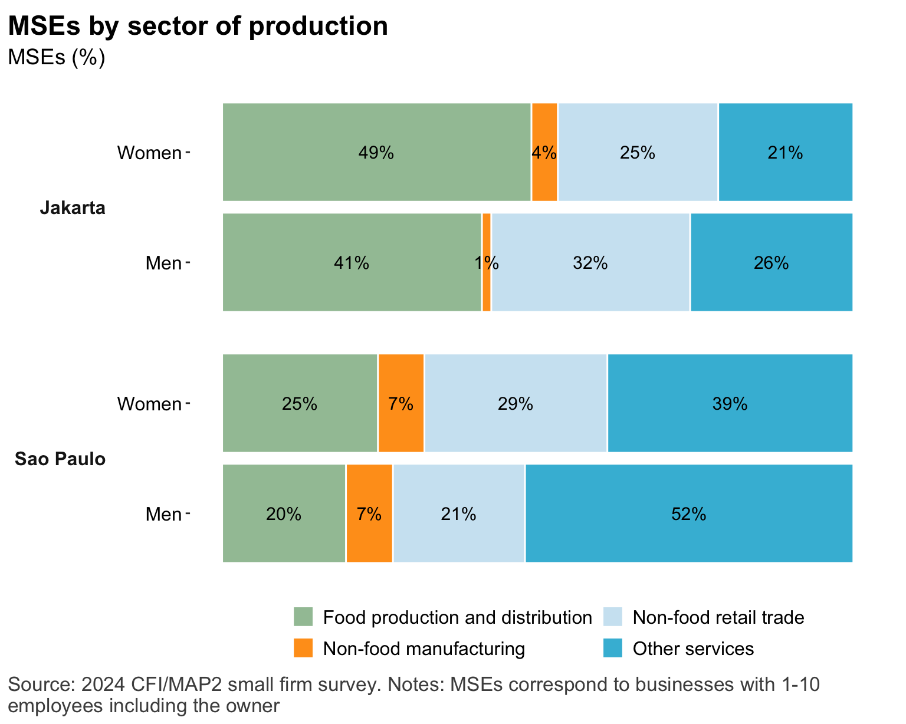

## Characteristics of MSEs

## The business landscape

::: {.cell .caption-margin}
::: {.cell-output-display}
{#fig-nbus_size_and_sector width=768}
:::
:::

::: {.cell .caption-margin}
::: {.cell-output-display}
{#fig-mse_sector width=768}
:::
:::

## Characteristics of MSE owners 

::: {.cell .caption-margin}
::: {.cell-output-display}
{#fig-mse_owner_chars width=1152}
:::
:::

## Insurance adoption segments

::: {.cell .caption-margin}
::: {.cell-output-display}
{#fig-ins_segments_1 width=1152}
:::
:::

::: {.cell .caption-margin}
::: {.cell-output-display}
{#fig-ins_segments_1_v2 width=1152}
:::
:::

## Insurance market segments

::: {.cell .caption-margin}
::: {.cell-output-display}
{#fig-ins_segments_2 width=1152}
:::
:::

## Predictors of insurance adoption segments

::: {.panel-tabset}

### Sao Paulo

::: {.cell .caption-margin}
::: {.cell-output-display}
{#fig-ins_segment_predictors_brazil width=1152}
:::
:::

### Jakarta

::: {.cell .caption-margin}
::: {.cell-output-display}
{#fig-ins_segments_3_indonesia width=1152}
:::
:::

:::

## Predictors of interest in future health insurance purchasing

::: {.cell .caption-margin}
::: {.cell-output-display}
{#fig-healthins_predictors_combined width=1152}
:::
:::

## General perceptions of insurance

::: {.cell}

:::

::: {.panel-tabset}

### Sao Paulo

::: {.cell .caption-margin}
::: {.cell-output-display}
{#fig-insur_opinions_brazil width=1152}
:::
:::

### Jakarta

::: {.cell .caption-margin}
::: {.cell-output-display}
{#fig-insur_opinions_indonesia width=1152}
:::
:::

:::

## Likelihood of purchasing insurance in next 12 months

::: {.cell}
::: {.cell-output-display}
{#fig-insur_topurchase_data_combined width=1152}
:::
:::

::: {.cell}

:::

::: {.panel-tabset}

### Sao Paulo

::: {.cell .caption-margin}
::: {.cell-output-display}
{#fig-insur_topurchase_brazil width=1152}
:::
:::

### Jakarta

::: {.cell .caption-margin}
::: {.cell-output-display}
{#fig-insur_topurchase_indonesia width=1152}
:::
:::

:::

## Perceptions of insurance value and benefits

::: {.cell}

:::

::: {.panel-tabset}

### Sao Paulo

::: {.cell .caption-margin}
::: {.cell-output-display}
{#fig-insur_valueprop_brazil width=1152}
:::
:::

### Jakarta

::: {.cell .caption-margin}
::: {.cell-output-display}
{#fig-insur_valueprop_indonesia width=1152}
:::
:::

:::

## Perceptions of insurance value and benefits: version 2

::: {.cell}
::: {.cell-output-display}
{#fig-insur_valueprop_data_v2 width=1152}
:::
:::

## Reasons insurance not currently used

::: {.cell}

:::

::: {.panel-tabset}

### Sao Paulo

::: {.cell .caption-margin}
::: {.cell-output-display}
{#fig-insur_notused_brazil width=1152}
:::
:::

### Jakarta

::: {.cell .caption-margin}
::: {.cell-output-display}
{#fig-insur_notused_indonesia width=1152}
:::
:::

::: 

## Ways insurance products are accessed

::: {.cell}

:::

::: {.panel-tabset}

### Sao Paulo

::: {.cell .caption-margin}
::: {.cell-output-display}
{#fig-insur_channels_brazil width=1152}
:::
:::

### Jakarta

::: {.cell .caption-margin}
::: {.cell-output-display}
{#fig-insur_channels_indonesia width=1152}
:::
:::

::: 

## Experience with claims

::: {.cell}

:::

::: {.panel-tabset}

### Sao Paulo

::: {.cell .caption-margin}
::: {.cell-output-display}
{#fig-insur_claims_brazil width=1152}
:::
:::

### Jakarta

::: {.cell .caption-margin}
::: {.cell-output-display}
{#fig-insur_claims_indonesia width=1152}
:::
:::

::: 

## Consumer protection issues

::: {.cell}

:::

::: {.panel-tabset}

### Sao Paulo

::: {.cell .caption-margin}
::: {.cell-output-display}
{#fig-insur_cp_brazil width=1152}
:::
:::

### Jakarta

::: {.cell .caption-margin}
::: {.cell-output-display}
{#fig-insur_cp_indonesia width=1152}
:::
:::

::: 

## Trust of insurance companies 

::: {.cell .caption-margin}

:::

::: {.panel-tabset}

### Sao Paulo

::: {.cell .caption-margin}
::: {.cell-output-display}
{#fig-insur_trust_brazil width=1152}
:::
:::

### Jakarta

::: {.cell .caption-margin}
::: {.cell-output-display}
{#fig-insur_trust_indonesia width=1152}
:::
:::

::: 

## Annex

### Prevalence of insurance adoption

::: {.cell .caption-margin}
::: {.cell-output-display}
{#fig-insur_adoption width=1152}
:::
:::

### Insurance adoption, by product type

::: {.panel-tabset}

#### Brazil

::: {.cell .caption-margin}
::: {.cell-output-display}
{#fig-insur_adoption_brazil width=1152}
:::
:::

#### Indonesia

::: {.cell .caption-margin}
::: {.cell-output-display}
{#fig-insur_adoption_indonesia width=1152}
:::
:::

:::

### Health insurance adoption, by cover type

::: {.cell .caption-margin}
::: {.cell-output-display}
{#fig-health_ins_types width=1152}
:::
:::

### Customer satisfaction

::: {.cell .caption-margin}
::: {.cell-output-display}
{#fig-insur_recos width=1152}
:::
:::

### Health shocks: Exposure and experience with health insurance

Notes: There are a series of questions in the survey (H6 - H10) that were asked to respondent who used insurance payouts to cope with a recent health shock (past 36 months). However, there are too few respondents using insurance payouts for these data to be reliable. 

::: {.cell .caption-margin}
::: {.cell-output-display}
{#fig-hlthrisks_combined width=1152}
:::
:::

::: {.cell .caption-margin}
::: {.cell-output-display}
{#fig-health_insurance_purchase width=1152}
:::
:::

::: {.cell .caption-margin}
::: {.cell-output-display}
{#fig-health_expenses width=1152}
:::
:::

### Climate shocks

Notes: There are a series of questions in the survey (C7 - C11) that were asked to respondent who used insurance payouts to cope with a recent climate shock (past 36 months). However, there are too few respondents using insurance payouts for these data to be reliable. 

::: {.cell .caption-margin}
::: {.cell-output-display}
{#fig-climate_insurance_purchase width=1152}
:::
:::
